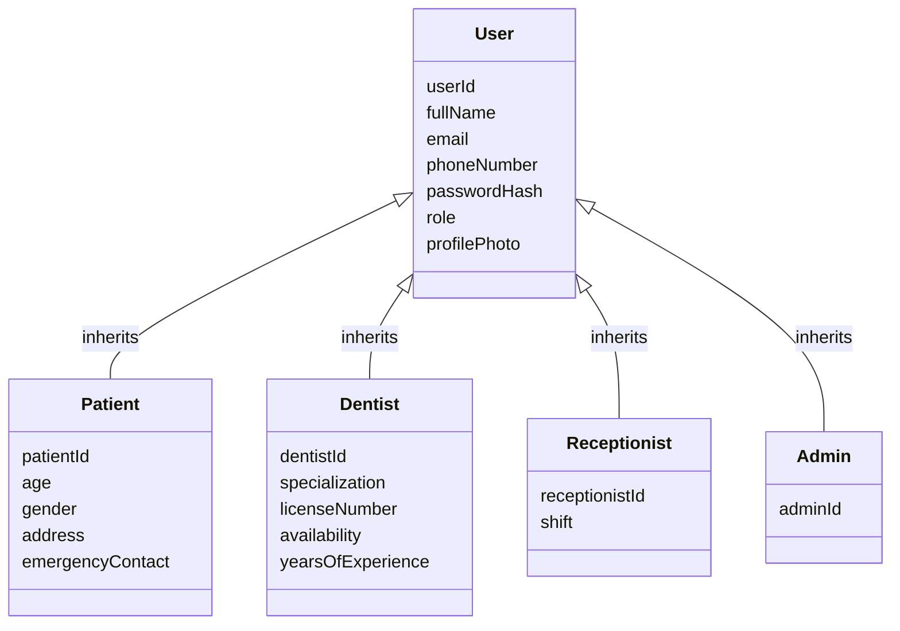
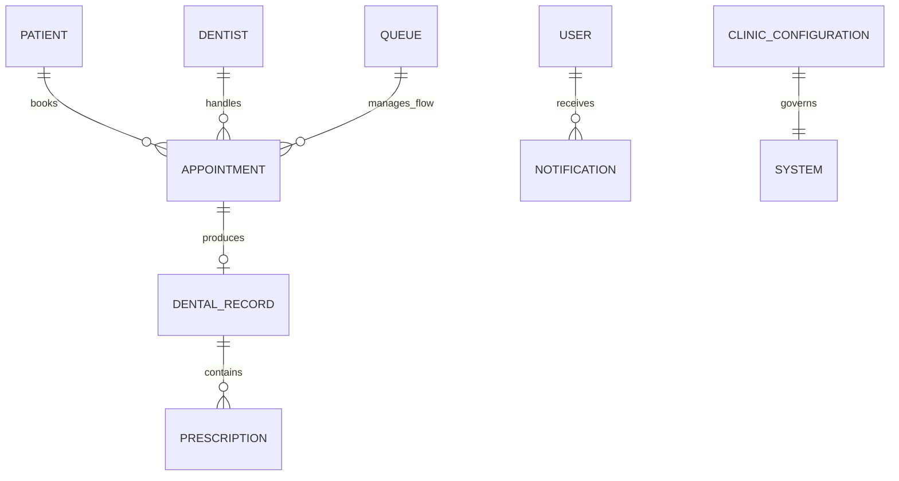
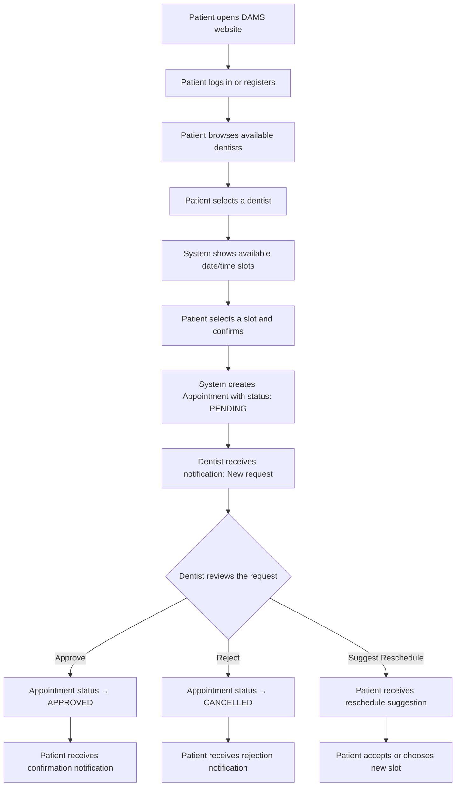
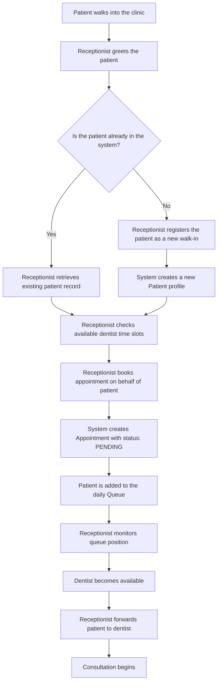
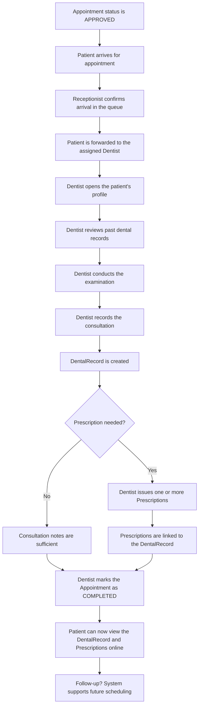
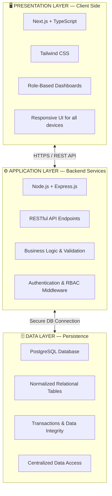

# 🦷 DAMS — Comprehensive High-Level Project Blueprint

## Dentist Appointments & Management System

> *A narrative-driven blueprint ensuring perfect understanding of the system's logic before a single line of code is written.*

---

## 1. Project Vision & Core Purpose

### The "Why": The Problem We Are Solving

In Ethiopia today, the vast majority of private dental clinics operate on a fully manual system that has remained largely unchanged for decades. The patient experience begins with a **physical visit** — just to check whether a dentist is available. Appointments are scratched into paper logbooks. Patient histories live in manila folders that can be misplaced, damaged by water, or simply lost in a growing stack. Prescriptions are handwritten. Follow-ups depend on a patient's own memory because there is no reminder system. Receptionists manage queues with verbal announcements. Clinic owners have no dashboard, no statistics, and no way to observe how their practice is performing.

The consequences are real and measurable:

| Manual System Problem | Human Impact |
|---|---|
| Paper-based appointment books | Double-bookings, overbookings, scheduling chaos |
| No reminder system | High no-show rates, wasted dentist time |
| Handwritten patient files | Lost histories, inconsistent diagnoses, slower treatments |
| Verbal queue management | Long, unpredictable waiting times for patients |
| No centralized data | Clinic owners are blind to operational performance |
| No access control | Sensitive medical data exposed to anyone in the clinic |

### The "What": What DAMS Delivers

The **Dentist Appointments and Management System (DAMS)** is a web-based digital platform that replaces every one of these manual processes with a centralized, secure, role-aware system. It is purpose-built for the operational reality of Ethiopian private dental clinics — designed to be simple enough for staff with limited computer experience, lightweight enough for unreliable internet, and resilient enough to handle power interruptions without losing data.

DAMS empowers **four distinct user roles** — Patient, Dentist, Receptionist, and Administrator — each with a tailored experience that mirrors and enhances their existing clinic workflows, not replaces them with alien processes.

The vision is not to build "software for software's sake." It is to **modernize dental service delivery** by:
- Eliminating crowding and wasted time
- Improving accuracy of medical records
- Creating a smooth, predictable experience for both patients and dentists
- Giving clinic owners visibility into their own practice for the first time

---

## 2. The Entity Ecosystem

The system is built around **ten core entities** that together model the complete world of a dental clinic. Here is each entity and how they relate to one another, in plain language.

### 2.1 The People

#### **User** — The Universal Identity
Every person in the system — whether they are a patient, a dentist, a receptionist, or an administrator — is first and foremost a **User**. The User entity holds the shared identity: full name, email, phone number, a securely hashed password, a role designation, and an optional profile photo. This is the single source of truth for authentication: *"Who are you, and what are you allowed to do?"*

#### **Patient** — The Care Recipient
A Patient **extends** User with medical and demographic context: age, gender, residential address, and an emergency contact. A patient is the person who books appointments, receives care, and accumulates a dental history over time. Patients can self-register online or be registered by a receptionist during a walk-in visit.

#### **Dentist** — The Care Provider
A Dentist **extends** User with professional context: their specialization (e.g., orthodontics, oral surgery), license number, years of experience, and their declared availability (working hours and days). Dentists are the gatekeepers of clinical care — they approve or reject appointment requests, conduct consultations, record diagnoses, and issue prescriptions.

#### **Receptionist** — The Operational Bridge
A Receptionist **extends** User minimally, adding only a shift assignment (e.g., morning, afternoon). The receptionist's power comes from what they *do*, not what data they hold — they are the bridge between patients arriving at the clinic and the dentists who will treat them.

#### **Admin (Clinic Administrator)** — The System Governor
The Admin **extends** User with full administrative privileges. They do not treat patients or manage queues. Instead, they govern the system: creating and managing staff accounts, configuring clinic operations, and monitoring performance.

### 2.2 The Clinical Objects

#### **Appointment** — The Central Transaction
The Appointment is the **heartbeat of the entire system**. It connects a Patient to a Dentist on a specific date and time. Every appointment carries a status that tracks its lifecycle: `Pending` → `Approved` → `Completed` (or `Cancelled` at any stage). An appointment can also be flagged as an **emergency**. The appointment is always **created first** — either by the patient online, or by the receptionist for a walk-in — and everything else (consultation, treatment, prescription) flows from it.

#### **DentalRecord** — The Clinical Memory
A DentalRecord is **produced by a consultation**. When a dentist sees a patient during an approved appointment, they record a diagnosis (what they found), the treatment performed, any additional clinical notes, and the visit date. Over time, a patient accumulates many DentalRecords, forming their complete dental history. Each record is permanently linked to both the patient and the treating dentist.

#### **Prescription** — The Treatment Instruction
A Prescription belongs to a specific DentalRecord. It captures the medicine name, dosage instructions, duration, and any additional remarks or follow-up recommendations. A single consultation may produce multiple prescriptions (e.g., an antibiotic and a painkiller). Patients can view their prescriptions digitally through the system.

#### **Notification** — The Communication Pulse
Notifications are generated by the system to keep users informed. They cover appointment confirmations, reminders, status changes (approved, rejected, rescheduled), and other alerts. Every notification is linked to a specific User. In the initial version, notifications are delivered **in-app**; future enhancements may add SMS and email channels.

#### **Queue** — The Daily Flow Controller
The Queue entity supports the receptionist's daily operations. It tracks which patients have arrived, their position in the waiting sequence, and which dentist they are being forwarded to. It aggregates appointment flow data for the current day, turning the clinic's chaotic verbal queue into an ordered, visible system.

#### **ClinicConfiguration** — The Rules Engine
ClinicConfiguration is a system-wide settings entity managed exclusively by the Administrator. It defines the clinic's operational rules: working days and hours, standard appointment duration, holiday schedules, and emergency slot allocations. Every scheduling decision in the system references this configuration.

### 2.3 Relationship Summary in Plain Language

| Relationship | Description |
|---|---|
| One Patient → Many Appointments | A patient can book multiple appointments over time |
| One Dentist → Many Appointments | A dentist handles many patients across their schedule |
| One Appointment → One DentalRecord | Each consultation visit produces exactly one clinical record |
| One DentalRecord → Many Prescriptions | A single visit can result in multiple prescribed medications |
| One User → Many Notifications | Every user receives their own stream of system alerts |
| ClinicConfiguration → System-wide | A single configuration governs all scheduling rules |

---

## 3. Comprehensive Feature Catalog

### 3.1 🧑‍💼 The Patient Experience

The patient is the primary consumer of the system. Their experience is designed to be **simple, self-service, and empowering** — they should be able to do from home what previously required a physical visit.

| Feature | Description |
|---|---|
| **Self-Registration** | Create a personal account with full name, email, phone, age, gender, address, and emergency contact. No clinic visit required. |
| **Secure Login / Logout** | Authenticate with email and password. Session is role-aware and secured. |
| **Profile Management** | Update personal information, change password, upload profile photo at any time. |
| **Browse Dentists** | View available dentists, their specializations, experience, and open time slots. |
| **Book Appointment** | Select a dentist, choose an available date and time, and submit a booking request. The request enters a `Pending` state awaiting dentist approval. |
| **Request Emergency Appointment** | Flag an appointment as an emergency, triggering priority handling. |
| **Reschedule Appointment** | Change the date or time of an existing appointment (when the status permits). |
| **Cancel Appointment** | Cancel a booked appointment. The system updates the status and frees the slot. |
| **View Appointment History** | See all past and upcoming appointments with their current statuses. |
| **View Dental Records** | Access the full clinical history: past diagnoses, treatments, and visit notes. |
| **View Prescriptions** | View digital prescriptions including medicine names, dosages, durations, and follow-up remarks. |
| **Receive Notifications** | Get in-app notifications for appointment confirmations, approvals, rejections, reminders, and status changes. |

### 3.2 🩺 The Dentist's Clinical Tools

The dentist's interface is a **clinical workspace** — designed for rapid decision-making during busy clinic hours.

| Feature | Description |
|---|---|
| **Secure Login / Logout** | Role-specific authentication with access to clinical features only. |
| **Profile & Availability Management** | Update personal profile, set and modify available working hours and days. |
| **View Schedule** | See daily and weekly appointment schedules at a glance, with patient details. |
| **Manage Appointment Requests** | Review incoming `Pending` appointments. Approve to confirm, reject with a reason, or suggest a reschedule. |
| **Access Patient Records** | View the complete dental history of any assigned patient before or during a consultation. |
| **Conduct Consultation** | Record the clinical outcome: diagnosis, treatment performed, and clinical notes. This creates a new DentalRecord. |
| **Issue Prescriptions** | Create digital prescriptions linked to the consultation record — including medicine name, dosage, duration, and follow-up remarks. |
| **Mark Appointment Complete** | Transition an appointment from `Approved` to `Completed` after the consultation is finished. |
| **Receive Notifications** | Get alerts for new appointment requests, cancellations, and schedule changes. |

### 3.3 🖥️ The Receptionist's Operational Hub

The receptionist is the **operational nerve center** of the clinic, bridging the gap between the digital system and the physical clinic floor.

| Feature | Description |
|---|---|
| **Secure Login / Logout** | Role-specific authentication with access to operational features. |
| **Register Walk-in Patients** | Create a patient profile for individuals who arrive without prior online registration. If the patient already exists, retrieve their existing record. |
| **Search Patients** | Find patients by name, phone number, or ID to access their records quickly. |
| **Update Patient Information** | Modify basic patient details (contact info, address) as needed. |
| **Book Appointments on Behalf of Patients** | Schedule appointments for walk-in patients or those who call in, selecting available dentists and time slots. |
| **Modify Appointments** | Reschedule or cancel appointments when patients request changes in person or by phone. |
| **Manage Patient Queue** | Track patient arrivals, maintain a digital waiting list, and forward patients to available dentists in order. |
| **Daily Coordination** | Serve as the communication hub between arriving patients and dentists' schedules, ensuring smooth clinic flow. |

### 3.4 ⚙️ The Administrator's Command Center

The administrator operates at the **system level** — they don't interact with patients clinically but ensure the entire system runs correctly.

| Feature | Description |
|---|---|
| **Secure Login / Logout** | Highest-privilege authentication with full system access. |
| **Staff Account Management** | Create, update, and deactivate accounts for dentists and receptionists. Assign roles and privileges. |
| **Assign Dentist Availability** | Configure working hours, days, and schedules for each dentist. |
| **Clinic Configuration** | Set system-wide parameters: working days, opening/closing hours, standard appointment duration, holiday schedules, and emergency slot allocations. |
| **View Clinic Dashboard** | Access a statistics dashboard showing appointment volumes, patient counts, and operational metrics. |
| **System Oversight** | Monitor system activity and ensure all users are operating within their authorized roles. |

---

## 4. The "Golden Thread" Feature Flows

These are the end-to-end journeys for the system's most critical processes, described as narratives without any code logic.

### 4.1 🟢 The Online Booking Journey

> *A patient books an appointment from their home or phone*

**The Story:**
1. A patient — perhaps experiencing a toothache — opens the DAMS website on their phone or computer.
2. If they are new, they register with their personal details. If they are returning, they log in.
3. They browse the list of available dentists, seeing each one's specialization, experience, and open time slots.
4. They select the dentist they prefer and choose a date and time that works for them.
5. They confirm the booking. The system creates an Appointment with a `Pending` status — because no appointment is automatically confirmed. It must be approved by the dentist.
6. The dentist receives an in-app notification about the new request. They review it, and either **approve** (confirming the appointment), **reject** (declining with a reason), or **suggest a reschedule** (proposing a different time).
7. The patient is notified of the outcome. If approved, they now have a confirmed appointment to attend. If rejected or rescheduled, they receive the reason and can take appropriate action.

**Why this matters:** This flow eliminates the need for the patient to physically visit the clinic just to check availability — the single most frustrating aspect of the current manual system.

---

### 4.2 🟡 The Walk-in Patient Entry Flow

> *A patient arrives at the clinic door without any prior booking*

**The Story:**
1. A patient walks through the clinic door — maybe they called ahead, or maybe they just showed up.
2. The receptionist greets them and searches the system. If the patient has visited before, their existing record is pulled up instantly. If they are completely new, the receptionist registers them on the spot — entering their basic information (name, phone, age, gender, address, emergency contact).
3. The receptionist then checks which dentists are available and books an appointment on the patient's behalf.
4. The patient is added to the **daily queue** — a digital waiting list that replaces the old verbal "please sit and wait" approach.
5. The receptionist monitors the queue and, when a dentist becomes available, forwards the next patient for their consultation.

**Why this matters:** This flow preserves the reality that many Ethiopian patients will still walk in without prior booking. The system doesn't reject this — it embraces it through the receptionist's operational hub, while still digitizing the entire process.

---

### 4.3 🔵 The Consultation and Treatment Cycle

> *From an approved appointment to a completed treatment with prescriptions*

**The Story:**
1. The starting point is an appointment that has already been **approved** by the dentist.
2. On the scheduled day, the patient arrives at the clinic. The receptionist confirms their arrival and places them in the queue.
3. When it's their turn, the receptionist forwards them to the assigned dentist.
4. The dentist opens the patient's profile and reviews their past dental records — previous diagnoses, treatments, and notes from prior visits. This is the **clinical memory** that was impossible with paper files.
5. The dentist conducts the physical examination and then records the outcome in the system: the diagnosis (what they found), the treatment performed (what they did), and any additional clinical notes.
6. This creates a new **DentalRecord** permanently linked to this patient and this visit.
7. If medication is needed, the dentist creates one or more **Prescriptions** — each specifying the medicine, dosage, duration, and any follow-up remarks. These prescriptions are attached to the DentalRecord.
8. The dentist then marks the appointment as **Completed**, transitioning its status from `Approved` to `Completed`.
9. The patient can now log into DAMS from their phone or computer and view their consultation results, dental record, and prescriptions — digitally, at any time, from anywhere.

**Why this matters:** This flow transforms the dental consultation from a paper-and-memory exercise into a fully documented, traceable, and accessible digital record — improving continuity of care and patient empowerment.

---

## 5. Architectural Foundation & Tech Stack

### 5.1 Three-Tier Client-Server Architecture

DAMS adopts a **three-tier web-based architecture** that cleanly separates concerns into three independent layers:

| Layer | Technology | Responsibility |
|---|---|---|
| **Presentation** | Next.js, TypeScript, Tailwind CSS | User interface, client-side validation, form handling, responsive design |
| **Application** | Node.js, Express.js | Business logic, API routing, authentication, authorization, data validation |
| **Data** | PostgreSQL | Persistent storage, relational integrity, transactions, query execution |

### 5.2 Why This Tech Stack is the Best Fit

Each technology choice is deliberate and maps to the constraints identified in the proposal:

#### **Next.js (Frontend)**
- **Server-Side Rendering (SSR)** improves initial page load speed — critical when internet bandwidth is limited in Ethiopia.
- **File-based routing** simplifies the codebase for maintainability by a small development team within an academic timeline.
- Built-in **optimizations** (image compression, code splitting) reduce bandwidth consumption.
- React-based component architecture allows building four distinct role dashboards from reusable components.

#### **Express.js on Node.js (Backend)**
- **Lightweight and unopinionated** — avoids unnecessary complexity for a system that needs to be built within an academic semester.
- **Stateless RESTful API design** allows horizontal scaling if the clinic network grows.
- **Middleware architecture** naturally supports role-based access control (RBAC) — authentication and authorization can be enforced at the API gateway level.
- The JavaScript/TypeScript ecosystem means the same language is used across the entire stack, reducing cognitive load for a small team.

#### **PostgreSQL (Database)**
- **ACID-compliant transactions** ensure data consistency even during power interruptions — a critical requirement for the Ethiopian operating environment.
- **Relational integrity** through primary and foreign keys perfectly models the entity relationships (User → Patient → Appointment → DentalRecord → Prescription).
- **Open-source and free** — eliminates licensing costs for financially constrained clinics.
- **Mature and battle-tested** — handles the concurrency needs of a small-to-medium clinic without performance concerns.
- **Robust recovery mechanisms** support quick data recovery after unexpected shutdowns.

### 5.3 Security Architecture

| Mechanism | Purpose |
|---|---|
| **Password Hashing** | User passwords are never stored in plain text — they are cryptographically hashed. |
| **Role-Based Access Control (RBAC)** | Every API endpoint checks the user's role before granting access. A patient cannot access admin features; a receptionist cannot write clinical records. |
| **Session / Token Management** | Authenticated sessions are securely managed with proper validation and expiration. |
| **HTTPS Communication** | All data in transit is encrypted to prevent interception. |
| **Centralized Database Access** | No client-side code directly touches the database. All access is mediated through backend services. |

---

## 6. Scope & Constraints

### 6.1 What Is Strictly In-Scope (Version 1.0)

> [!IMPORTANT]
> The following features constitute the **Minimum Viable Product** — these must be fully functional at project completion.

| Area | In-Scope Features |
|---|---|
| **Authentication** | Registration, login, logout, role-based dashboards |
| **Patient Management** | Self-registration, profile management, walk-in registration by receptionist |
| **Appointment Management** | Online booking, approval/rejection by dentist, rescheduling, cancellation, emergency flagging |
| **Clinical Records** | Consultation recording (diagnosis, treatment, notes), dental history viewing |
| **Prescriptions** | Digital prescription creation by dentists, viewing by patients |
| **Queue Management** | Walk-in patient queue, arrival tracking, forwarding to dentists |
| **Notifications** | In-app notifications for appointment status changes and reminders |
| **Administration** | Staff CRUD, dentist availability management, clinic configuration, basic dashboard |

### 6.2 What Is Explicitly Out-of-Scope (Future Enhancements)

> [!NOTE]
> These are valuable features identified in the proposal as **future enhancements**, not requirements for Version 1.0.

- ❌ **Online Payment Integration** — Secure payment gateways for consultation fees
- ❌ **Mobile Applications** — Native Android and iOS apps
- ❌ **SMS and Email Notifications** — External notification channels (only in-app for V1)
- ❌ **Advanced Analytics & Reporting** — Deep operational analytics with trend analysis
- ❌ **AI-Based Optimization** — Predictive scheduling and no-show probability
- ❌ **National Health System Integration** — Interoperability with government health records
- ❌ **Imaging Device Integration** — X-ray or imaging hardware connectivity
- ❌ **Bulk Data Migration** — Automated import of existing paper records

### 6.3 Real-World Constraints the System Must Handle

These are not hypothetical concerns — they are the daily reality of operating a digital system in Ethiopian private clinics.

> [!WARNING]
> Each constraint below directly influences architectural and design decisions.

| Constraint | Impact on System Design |
|---|---|
| **🌐 Unreliable Internet** | System must minimize bandwidth usage, avoid unnecessary network requests, and handle network failure gracefully. Critical operations must show clear feedback on success or failure. Pages should load quickly even on slow connections (leveraging SSR). |
| **⚡ Power Interruptions** | PostgreSQL's ACID transactions prevent data corruption during unexpected shutdowns. The system must ensure that partially completed operations (e.g., a half-saved appointment) are either fully committed or fully rolled back. Quick recovery on power restoration is essential. |
| **📱 Varying Technical Literacy** | The interface must be simple, intuitive, and forgiving. Complex multi-step workflows should be minimized. Clear error messages in plain language. Confirmation dialogs before destructive actions. The system should mirror existing clinic workflows rather than imposing alien ones. |
| **💰 Financial Constraints** | The entire stack is open-source and free. No licensing costs. The system runs on standard desktop hardware with modern browsers — no specialized equipment needed. |
| **🔐 Medical Data Privacy** | Strict RBAC ensures patients can only see their own records. Clinical data is only writable by dentists. Administrative functions are isolated to admin users. All passwords are hashed. All communication is encrypted. |
| **📊 Scalability Planning** | Designed for small-to-medium clinics initially. The layered architecture supports future growth without requiring a rewrite. Over-engineering for nationwide scale is avoided. |
| **📋 Change Management** | The system mirrors existing clinic workflows (receptionist-managed walk-ins, dentist-approved appointments) to minimize staff resistance. Training requirements are kept minimal through intuitive design. |
| **📝 Paper Record Coexistence** | The system supports gradual digitization. Clinics can begin using DAMS alongside their paper records and migrate over time. Bulk paper-to-digital migration is not required. |

---

## Summary

This blueprint establishes the complete logical foundation for DAMS:

1. **We know WHY** — Ethiopian dental clinics need to escape manual, error-prone, inaccessible paper systems
2. **We know WHO** — Four distinct user roles with clearly defined responsibilities and permissions
3. **We know WHAT** — Every feature cataloged for each role, with no ambiguity
4. **We know HOW IT FLOWS** — Three "golden thread" journeys trace the critical paths through the system
5. **We know THE ARCHITECTURE** — Three-tier, open-source stack chosen for the specific constraints of the environment
6. **We know THE BOUNDARIES** — Clear in-scope vs. out-of-scope delineation prevents scope creep

> [!TIP]
> With this blueprint validated, the next step is to create a **Technical Implementation Plan** — the detailed, file-by-file, package-by-package build plan that translates this blueprint into code.
