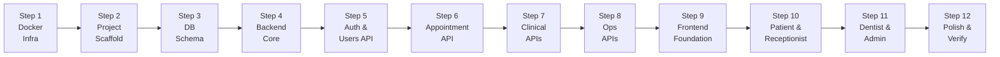

# 🏗️ DAMS — Technical Implementation Plan

## Exhaustive, End-to-End Build Sequence with Standalone AI Prompts

> **Design Principle:** Every prompt is a self-contained instruction set. Open a **fresh IDE chat**, paste the prompt, and execute. No context from previous sessions is needed.

---

## Phase Overview

| Phase | Steps | What Gets Built |
|---|---|---|
| **Phase 1: Infrastructure** | Steps 1–2 | Docker ecosystem + project scaffolding for all three tiers |
| **Phase 2: Data & Backend Foundation** | Steps 3–4 | PostgreSQL schema (all tables) + Express.js boilerplate with auth middleware |
| **Phase 3: Core Backend APIs** | Steps 5–6 | User management, appointment lifecycle (with receptionist-bridge), dentist schedule APIs |
| **Phase 4: Clinical & Operational APIs** | Steps 7–8 | Consultation, prescription, queue, notification, admin, and clinic config APIs |
| **Phase 5: Frontend** | Steps 9–11 | Next.js foundation + all four role dashboards (Patient, Receptionist, Dentist, Admin) |
| **Phase 6: Integration & Polish** | Step 12 | Seed data, end-to-end testing, Docker verification, production readiness |



---

## Step 1 — Docker Infrastructure & docker-compose

> **Phase 1: Infrastructure** · Estimated effort: ~30 min

````markdown
# DAMS Step 1: Docker Infrastructure

## Project Context
You are building the **Dentist Appointments and Management System (DAMS)** — a web-based platform for Ethiopian private dental clinics. It has four user roles (Patient, Dentist, Receptionist, Admin) and manages appointments, dental records, prescriptions, queue management, and notifications.

## Current Codebase State
This is **Step 1 of 12** — the codebase is completely empty. We are starting from scratch.

## Your Task
Create the complete Docker infrastructure so the entire system can be launched with a single `docker-compose up` command. A non-technical person receiving this repo as a ZIP should be able to run it without installing Node.js, npm, or PostgreSQL locally.

## Tech Stack
- **Frontend:** Next.js 14 (App Router) with TypeScript
- **Backend:** Node.js 20 + Express.js with TypeScript
- **Database:** PostgreSQL 16
- **Containerization:** Docker + Docker Compose

## Deliverables — Create These Files

### 1. `docker-compose.yml` (project root)
Define three services:
- **`db`** — PostgreSQL 16 container
  - Container name: `dams-db`
  - Port mapping: `5432:5432`
  - Environment: `POSTGRES_DB=dams`, `POSTGRES_USER=dams_user`, `POSTGRES_PASSWORD=dams_password`
  - Volume: `postgres_data:/var/lib/postgresql/data` for data persistence
  - Healthcheck: `pg_isready -U dams_user -d dams`
- **`backend`** — Express.js API server
  - Container name: `dams-backend`
  - Build context: `./backend`
  - Port mapping: `5000:5000`
  - Environment variables pointing to the db service: `DATABASE_URL=postgresql://dams_user:dams_password@db:5432/dams`, `JWT_SECRET=dams-jwt-secret-change-in-production`, `NODE_ENV=development`, `PORT=5000`
  - Depends on: `db` (with healthcheck condition)
  - Volume: `./backend:/app` and `/app/node_modules` (anonymous volume for node_modules)
  - Command: `npm run dev`
- **`frontend`** — Next.js application
  - Container name: `dams-frontend`
  - Build context: `./frontend`
  - Port mapping: `3000:3000`
  - Environment: `NEXT_PUBLIC_API_URL=http://localhost:5000/api`
  - Depends on: `backend`
  - Volume: `./frontend:/app` and `/app/node_modules`
  - Command: `npm run dev`

### 2. `backend/Dockerfile`
- Base: `node:20-alpine`
- Set `WORKDIR /app`
- Copy `package*.json`, run `npm install`
- Copy rest of the source
- Expose port 5000
- Default CMD: `npm run dev`

### 3. `frontend/Dockerfile`
- Base: `node:20-alpine`
- Set `WORKDIR /app`
- Copy `package*.json`, run `npm install`
- Copy rest of the source
- Expose port 3000
- Default CMD: `npm run dev`

### 4. `.dockerignore` (one in project root, one in backend/, one in frontend/)
Ignore: `node_modules`, `.next`, `.env.local`, `.git`, `*.md`

### 5. `.env.example` (project root)
Document all environment variables with sensible defaults and comments.

### 6. `README.md` (project root)
Write a clear README with:
- Project title and description
- Prerequisites: Docker and Docker Compose only
- Quick start: `docker-compose up --build`
- Access URLs: Frontend at http://localhost:3000, Backend at http://localhost:5000, DB at localhost:5432
- Environment variable documentation
- How to stop: `docker-compose down`

## Important Notes
- Do NOT create any application source code yet — only Docker infrastructure files.
- The backend and frontend directories should exist but only contain Dockerfiles and .dockerignore at this point.
- Ensure the docker-compose handles the startup order correctly (DB must be healthy before backend starts).
````

---

## Step 2 — Project Scaffolding (Backend + Frontend Initialization)

> **Phase 1: Infrastructure** · Estimated effort: ~45 min

````markdown
# DAMS Step 2: Project Scaffolding

## Project Context
You are building **DAMS (Dentist Appointments and Management System)** — a web-based platform for Ethiopian private dental clinics with four user roles (Patient, Dentist, Receptionist, Admin). Architecture: Next.js frontend, Express.js backend, PostgreSQL database — fully Dockerized.

## Current Codebase State
**Step 1 is complete.** The following exist:
- `docker-compose.yml` — orchestrates 3 services (db, backend, frontend)
- `backend/Dockerfile` — Node 20 Alpine image for Express
- `frontend/Dockerfile` — Node 20 Alpine image for Next.js
- `.dockerignore` files, `.env.example`, `README.md`
- No application code exists yet.

## Your Task
Initialize the actual Node.js projects for both backend and frontend with clean, production-grade folder structures.

## Part A: Backend Project (`backend/`)

### Initialize
- Create `package.json` with project name `dams-backend`
- Dependencies: `express`, `cors`, `helmet`, `morgan`, `pg` (node-postgres), `bcryptjs`, `jsonwebtoken`, `dotenv`, `express-validator`, `multer`
- Dev dependencies: `typescript`, `ts-node`, `tsx`, `nodemon`, `@types/express`, `@types/cors`, `@types/bcryptjs`, `@types/jsonwebtoken`, `@types/multer`, `@types/morgan`, `@types/pg`
- Scripts: `"dev": "tsx watch src/index.ts"`, `"build": "tsc"`, `"start": "node dist/index.js"`

### TypeScript Config (`tsconfig.json`)
- Target: ES2022, Module: Node16, strict mode enabled
- OutDir: `./dist`, RootDir: `./src`

### Folder Structure
```
backend/src/
├── index.ts              — Express app entry point
├── config/
│   └── database.ts       — PostgreSQL connection pool (using pg Pool)
│   └── env.ts            — Environment variable validation
├── middleware/
│   └── auth.ts           — JWT verification middleware (placeholder)
│   └── rbac.ts           — Role-based access control middleware (placeholder)
│   └── errorHandler.ts   — Global error handling middleware
│   └── validate.ts       — Request validation middleware wrapper
├── routes/
│   └── index.ts          — Route aggregator
├── controllers/          — (empty, will be filled in later steps)
├── services/             — (empty, will be filled in later steps)
├── models/               — (empty, will be filled in later steps)
├── utils/
│   └── apiResponse.ts    — Standardized API response helper
│   └── constants.ts      — Enums and constants (roles, appointment statuses)
└── types/
    └── index.ts          — TypeScript type definitions
```

### Implement These Files

#### `src/index.ts`
- Create an Express app
- Apply middleware: `cors()`, `helmet()`, `morgan('dev')`, `express.json()`
- Mount routes at `/api`
- Apply global error handler
- Listen on `PORT` from environment (default 5000)
- Log startup message

#### `src/config/database.ts`
- Create and export a `pg.Pool` instance using `DATABASE_URL` from env
- Export a `query` helper function
- Export a `testConnection` function that logs success/failure

#### `src/config/env.ts`
- Load dotenv
- Export validated env variables with defaults

#### `src/middleware/errorHandler.ts`
- Express error middleware that catches all errors
- Returns standardized JSON: `{ success: false, message, error? }`
- Different behavior for development vs production

#### `src/utils/apiResponse.ts`
- `successResponse(res, data, message, statusCode)`
- `errorResponse(res, message, statusCode, error?)`

#### `src/utils/constants.ts`
Define enums:
```typescript
enum UserRole { PATIENT = 'patient', DENTIST = 'dentist', RECEPTIONIST = 'receptionist', ADMIN = 'admin' }
enum AppointmentStatus { PENDING = 'pending', REVIEWED = 'reviewed', FORWARDED = 'forwarded', APPROVED = 'approved', COMPLETED = 'completed', REJECTED = 'rejected', CANCELLED = 'cancelled', RESCHEDULED = 'rescheduled' }
enum NotificationType { APPOINTMENT_REQUEST = 'appointment_request', APPOINTMENT_APPROVED = 'appointment_approved', APPOINTMENT_REJECTED = 'appointment_rejected', APPOINTMENT_FORWARDED = 'appointment_forwarded', APPOINTMENT_RESCHEDULED = 'appointment_rescheduled', APPOINTMENT_CANCELLED = 'appointment_cancelled', APPOINTMENT_REMINDER = 'appointment_reminder', GENERAL = 'general' }
```

#### `src/types/index.ts`
Define TypeScript interfaces for all entities:
- `IUser`, `IPatient`, `IDentist`, `IReceptionist`, `IAdmin`
- `IAppointment`, `IDentalRecord`, `IPrescription`
- `INotification`, `IQueue`, `IClinicConfiguration`

#### `src/routes/index.ts`
- Create a router that mounts placeholder sub-routes
- Add a health check route: `GET /api/health` → `{ status: 'ok', timestamp }`

## Part B: Frontend Project (`frontend/`)

### Initialize
- Create as a Next.js 14 project with App Router
- Create `package.json` (name: `dams-frontend`)
- Dependencies: `next`, `react`, `react-dom`, `axios`
- Dev dependencies: `typescript`, `@types/react`, `@types/react-dom`, `@types/node`, `tailwindcss`, `postcss`, `autoprefixer`
- Scripts: `"dev": "next dev -H 0.0.0.0"`, `"build": "next build"`, `"start": "next start"`
  - Note: `-H 0.0.0.0` is essential for Docker container access

### Config Files
- `tsconfig.json` — Standard Next.js TypeScript config with path aliases (`@/*` → `./src/*`)
- `tailwind.config.ts` — Content paths covering `./src/**`
- `postcss.config.js` — Standard PostCSS with Tailwind and Autoprefixer
- `next.config.js` — Standard config, with `output: 'standalone'` commented out for now

### Folder Structure
```
frontend/src/
├── app/
│   ├── layout.tsx          — Root layout with metadata, fonts (Inter from Google Fonts)
│   ├── page.tsx            — Landing/home page (simple placeholder)
│   ├── globals.css         — Tailwind directives + CSS custom properties for the design system
│   ├── (auth)/
│   │   ├── login/page.tsx  — Login page placeholder
│   │   └── register/page.tsx — Register page placeholder
│   ├── dashboard/
│   │   ├── patient/        — (empty, placeholder)
│   │   ├── dentist/        — (empty, placeholder)
│   │   ├── receptionist/   — (empty, placeholder)
│   │   └── admin/          — (empty, placeholder)
├── components/
│   ├── ui/                 — Reusable UI components (empty for now)
│   └── layout/             — Layout components (empty for now)
├── lib/
│   ├── api.ts              — Axios instance configured with NEXT_PUBLIC_API_URL base URL
│   └── constants.ts        — Mirror of backend constants (roles, statuses)
├── types/
│   └── index.ts            — TypeScript types (mirror of backend types)
├── context/                — React contexts (empty for now)
└── hooks/                  — Custom hooks (empty for now)
```

### Implement These Files

#### `src/app/globals.css`
- Tailwind directives (`@tailwind base; @tailwind components; @tailwind utilities;`)
- CSS custom properties for the DAMS design system:
  - Primary color palette: Deep teal/blue tones (professional, medical feel)
  - Accent colors for status indicators (green=approved, yellow=pending, red=rejected, blue=forwarded)
  - Dark mode support
  - Font family: Inter

#### `src/app/layout.tsx`
- Import Inter from `next/font/google`
- HTML metadata: title "DAMS — Dentist Appointments & Management System", description
- Apply Inter font and globals.css

#### `src/app/page.tsx`
- Simple landing page with placeholder text: "DAMS — Dentist Appointments & Management System"
- Login / Register navigation links

#### `src/lib/api.ts`
- Create Axios instance with `baseURL: process.env.NEXT_PUBLIC_API_URL || 'http://localhost:5000/api'`
- Add request interceptor to attach JWT token from localStorage
- Add response interceptor for error handling

## Verification
After implementing everything, the following should work:
1. `docker-compose up --build` starts all three containers
2. `http://localhost:5000/api/health` returns `{ status: 'ok' }`
3. `http://localhost:3000` shows the placeholder landing page
4. No TypeScript or build errors in either project
````

---

## Step 3 — PostgreSQL Database Schema

> **Phase 2: Data & Backend Foundation** · Estimated effort: ~30 min

````markdown
# DAMS Step 3: PostgreSQL Database Schema

## Project Context
**DAMS** is a web-based dental clinic management system for Ethiopia with four roles: Patient, Dentist, Receptionist, Admin. It manages appointments (with a **receptionist-bridge workflow** — all appointments pass through the receptionist before reaching the dentist), dental records, prescriptions, queue management, and in-app notifications.

## Current Codebase State
**Steps 1-2 are complete.** The project has:
- Full Docker infrastructure (docker-compose with 3 services: db, backend, frontend)
- Backend: Express.js app skeleton with middleware, routing, constants, types, database pool config
- Frontend: Next.js 14 app with Tailwind CSS, placeholder pages
- Both apps run successfully via `docker-compose up`

## Your Task
Create the complete PostgreSQL database schema using raw SQL migration files. Create a migration runner that executes on backend startup.

## Appointment Status Lifecycle (Critical Business Logic)
```
PENDING → REVIEWED → FORWARDED → APPROVED → COMPLETED
                ↘ REJECTED     ↘ REJECTED
Patient              Receptionist    Dentist
creates              validates       decides
                     ↘ can also suggest alternative dentist
```
Statuses: `pending`, `reviewed`, `forwarded`, `approved`, `completed`, `rejected`, `cancelled`, `rescheduled`

## Deliverables

### 1. `backend/src/database/migrations/001_initial_schema.sql`

Create all tables in this order (respecting foreign key dependencies):

#### `users` table
```sql
- id              SERIAL PRIMARY KEY
- full_name       VARCHAR(100) NOT NULL
- email           VARCHAR(100) UNIQUE NOT NULL
- phone_number    VARCHAR(20)
- password_hash   VARCHAR(255) NOT NULL
- role            VARCHAR(20) NOT NULL CHECK (role IN ('patient','dentist','receptionist','admin'))
- profile_photo   VARCHAR(500)
- is_active       BOOLEAN DEFAULT true
- created_at      TIMESTAMP DEFAULT CURRENT_TIMESTAMP
- updated_at      TIMESTAMP DEFAULT CURRENT_TIMESTAMP
```

#### `patients` table
```sql
- id              SERIAL PRIMARY KEY
- user_id         INTEGER UNIQUE NOT NULL REFERENCES users(id) ON DELETE CASCADE
- date_of_birth   DATE
- gender          VARCHAR(10) CHECK (gender IN ('male','female','other'))
- address         TEXT
- emergency_contact VARCHAR(100)
- blood_group     VARCHAR(5)
- allergies       TEXT
- created_at      TIMESTAMP DEFAULT CURRENT_TIMESTAMP
```

#### `dentists` table
```sql
- id              SERIAL PRIMARY KEY
- user_id         INTEGER UNIQUE NOT NULL REFERENCES users(id) ON DELETE CASCADE
- specialization  VARCHAR(100)
- license_number  VARCHAR(50) UNIQUE
- years_of_experience INTEGER DEFAULT 0
- bio             TEXT
- created_at      TIMESTAMP DEFAULT CURRENT_TIMESTAMP
```

#### `dentist_availability` table (separate from dentists for flexibility)
```sql
- id              SERIAL PRIMARY KEY
- dentist_id      INTEGER NOT NULL REFERENCES dentists(id) ON DELETE CASCADE
- day_of_week     INTEGER NOT NULL CHECK (day_of_week BETWEEN 0 AND 6) -- 0=Sunday
- start_time      TIME NOT NULL
- end_time        TIME NOT NULL
- is_available    BOOLEAN DEFAULT true
- UNIQUE(dentist_id, day_of_week)
```

#### `receptionists` table
```sql
- id              SERIAL PRIMARY KEY
- user_id         INTEGER UNIQUE NOT NULL REFERENCES users(id) ON DELETE CASCADE
- shift           VARCHAR(20) CHECK (shift IN ('morning','afternoon','full_day'))
- created_at      TIMESTAMP DEFAULT CURRENT_TIMESTAMP
```

#### `appointments` table
```sql
- id              SERIAL PRIMARY KEY
- patient_id      INTEGER NOT NULL REFERENCES patients(id) ON DELETE CASCADE
- dentist_id      INTEGER NOT NULL REFERENCES dentists(id) ON DELETE CASCADE
- reviewed_by     INTEGER REFERENCES receptionists(id) -- receptionist who reviewed
- appointment_date DATE NOT NULL
- appointment_time TIME NOT NULL
- status          VARCHAR(20) DEFAULT 'pending' CHECK (status IN ('pending','reviewed','forwarded','approved','completed','rejected','cancelled','rescheduled'))
- is_emergency    BOOLEAN DEFAULT false
- reason          TEXT -- patient's reason for visit
- rejection_reason TEXT -- reason if rejected
- notes           TEXT -- general notes
- created_by_role VARCHAR(20) NOT NULL -- 'patient' or 'receptionist' (who created)
- created_at      TIMESTAMP DEFAULT CURRENT_TIMESTAMP
- updated_at      TIMESTAMP DEFAULT CURRENT_TIMESTAMP
```

#### `dental_records` table
```sql
- id              SERIAL PRIMARY KEY
- appointment_id  INTEGER UNIQUE REFERENCES appointments(id) ON DELETE SET NULL
- patient_id      INTEGER NOT NULL REFERENCES patients(id) ON DELETE CASCADE
- dentist_id      INTEGER NOT NULL REFERENCES dentists(id) ON DELETE CASCADE
- diagnosis       TEXT NOT NULL
- treatment       TEXT NOT NULL
- notes           TEXT
- visit_date      DATE NOT NULL DEFAULT CURRENT_DATE
- created_at      TIMESTAMP DEFAULT CURRENT_TIMESTAMP
```

#### `prescriptions` table
```sql
- id              SERIAL PRIMARY KEY
- dental_record_id INTEGER NOT NULL REFERENCES dental_records(id) ON DELETE CASCADE
- medicine_name   VARCHAR(200) NOT NULL
- dosage          VARCHAR(100) NOT NULL
- duration        VARCHAR(100)
- remarks         TEXT
- created_at      TIMESTAMP DEFAULT CURRENT_TIMESTAMP
```

#### `notifications` table
```sql
- id              SERIAL PRIMARY KEY
- user_id         INTEGER NOT NULL REFERENCES users(id) ON DELETE CASCADE
- title           VARCHAR(200) NOT NULL
- message         TEXT NOT NULL
- type            VARCHAR(50) DEFAULT 'general'
- is_read         BOOLEAN DEFAULT false
- related_appointment_id INTEGER REFERENCES appointments(id) ON DELETE SET NULL
- created_at      TIMESTAMP DEFAULT CURRENT_TIMESTAMP
```

#### `queue_entries` table
```sql
- id              SERIAL PRIMARY KEY
- appointment_id  INTEGER NOT NULL REFERENCES appointments(id) ON DELETE CASCADE
- patient_id      INTEGER NOT NULL REFERENCES patients(id) ON DELETE CASCADE
- dentist_id      INTEGER NOT NULL REFERENCES dentists(id) ON DELETE CASCADE
- queue_number    INTEGER NOT NULL
- status          VARCHAR(20) DEFAULT 'waiting' CHECK (status IN ('waiting','in_progress','completed','cancelled'))
- check_in_time   TIMESTAMP DEFAULT CURRENT_TIMESTAMP
- called_time     TIMESTAMP
- completed_time  TIMESTAMP
- queue_date      DATE NOT NULL DEFAULT CURRENT_DATE
- UNIQUE(queue_date, queue_number)
```

#### `clinic_configuration` table
```sql
- id              SERIAL PRIMARY KEY
- config_key      VARCHAR(100) UNIQUE NOT NULL
- config_value    TEXT NOT NULL
- description     TEXT
- updated_at      TIMESTAMP DEFAULT CURRENT_TIMESTAMP
```

Add indexes:
- `appointments.patient_id`, `appointments.dentist_id`, `appointments.appointment_date`, `appointments.status`
- `dental_records.patient_id`, `dental_records.dentist_id`
- `notifications.user_id`, `notifications.is_read`
- `queue_entries.queue_date`, `queue_entries.status`

Insert default clinic configuration:
- `working_days`: `'1,2,3,4,5'` (Mon-Fri)
- `opening_time`: `'08:00'`
- `closing_time`: `'17:00'`
- `appointment_duration_minutes`: `'30'`
- `max_appointments_per_day_per_dentist`: `'16'`

Create an `updated_at` trigger function and apply it to `users` and `appointments` tables.

### 2. `backend/src/database/migrate.ts`
- Read all SQL files from the migrations directory in order
- Execute them against the database
- Use a `migrations` tracking table to avoid re-running
- Export a `runMigrations()` function

### 3. Update `backend/src/index.ts`
- Call `runMigrations()` on startup (after DB connection test)
- Log migration results

## Verification
After `docker-compose up --build`:
- All tables are created in PostgreSQL
- Default clinic configuration values exist
- No migration errors in backend logs
- `GET /api/health` still works
````

---

## Step 4 — Backend Authentication & User Management

> **Phase 2: Data & Backend Foundation** · Estimated effort: ~60 min

````markdown
# DAMS Step 4: Authentication & User Management API

## Project Context
**DAMS** is a web-based dental clinic management system for Ethiopia. Four roles: Patient, Dentist, Receptionist, Admin. **All appointment requests flow through the Receptionist** as a mandatory bridge before reaching the dentist.

## Current Codebase State
**Steps 1-3 complete.** We have:
- Docker infrastructure (3 services: db on 5432, backend on 5000, frontend on 3000)
- Backend: Express.js with TypeScript, middleware skeleton, constants, types, database pool, standardized API responses
- Frontend: Next.js 14 with Tailwind CSS, Axios API client, placeholder pages
- Database: Full PostgreSQL schema with all 11 tables, indexes, defaults, migration runner
- All migrations run on startup successfully

## Your Task
Build the complete authentication system and user management API endpoints. This is the security foundation — every subsequent step depends on this.

## Deliverables

### 1. Auth Middleware — `backend/src/middleware/auth.ts`
Implement JWT verification middleware:
- Extract Bearer token from `Authorization` header
- Verify token using `JWT_SECRET` from env
- Decode payload: `{ userId, role, email }`
- Attach `req.user` with decoded payload
- Return 401 if no token or invalid token

### 2. RBAC Middleware — `backend/src/middleware/rbac.ts`
Implement role-based access control:
- `authorize(...allowedRoles: string[])` — returns middleware that checks `req.user.role`
- Returns 403 if user's role is not in the allowed list

### 3. Auth Service — `backend/src/services/authService.ts`
Business logic for authentication:
- `register(userData)` — Validates input, checks email uniqueness, hashes password with bcrypt (10 rounds), creates user record. If role is 'patient', also creates the patient profile record. Returns user object (without password_hash) + JWT token.
- `login(email, password)` — Finds user by email, compares password with bcrypt, generates JWT with payload `{ userId, role, email }` and 24h expiry. Returns user object + token.
- `getProfile(userId)` — Returns full user profile including role-specific data (patient details, dentist details, etc.)
- `updateProfile(userId, updateData)` — Updates user and role-specific profile fields.

### 4. User Service — `backend/src/services/userService.ts`
User management (primarily for Admin):
- `getAllUsers(filters?)` — List users with optional role filter, pagination
- `getUserById(id)` — Get single user with role-specific details
- `createStaffUser(userData)` — Admin creates dentist or receptionist accounts (including their role-specific profile data)
- `updateUser(id, updateData)` — Admin updates any user
- `toggleUserActive(id)` — Activate/deactivate user accounts
- `getDentistsPublic()` — Public list of dentists with their specialization, experience, and availability (for patients browsing)

### 5. Auth Controller — `backend/src/controllers/authController.ts`
Handle HTTP requests for auth:
- `POST /api/auth/register` — Body: `{ fullName, email, password, phoneNumber, dateOfBirth?, gender?, address?, emergencyContact? }`. Only creates Patient accounts (public registration). Validate with express-validator.
- `POST /api/auth/login` — Body: `{ email, password }`. Returns: `{ user, token }`.
- `GET /api/auth/profile` — Protected. Returns current user's full profile.
- `PUT /api/auth/profile` — Protected. Updates current user's profile.

### 6. User Controller — `backend/src/controllers/userController.ts`
Handle HTTP requests for user management:
- `GET /api/users` — Admin only. List all users with optional `?role=` filter and `?page=&limit=` pagination.
- `GET /api/users/:id` — Admin only. Single user details.
- `POST /api/users/staff` — Admin only. Create dentist or receptionist account. Body includes role-specific fields.
- `PUT /api/users/:id` — Admin only. Update user.
- `PATCH /api/users/:id/toggle-active` — Admin only. Activate/deactivate.
- `GET /api/dentists` — Public (any authenticated user). List dentists with their availability, specialization.
- `GET /api/dentists/:id/availability` — Public. Get specific dentist's availability schedule.

### 7. Auth Routes — `backend/src/routes/authRoutes.ts`
Wire up auth endpoints with validation rules.

### 8. User Routes — `backend/src/routes/userRoutes.ts`
Wire up user endpoints with auth + RBAC middleware.

### 9. Validation Rules — `backend/src/middleware/validators/authValidators.ts`
Define express-validator chains for:
- Registration: email format, password min 6 chars, fullName required
- Login: email and password required
- Profile update: optional fields validation

### 10. Update `backend/src/routes/index.ts`
Mount auth and user routes.

## Business Rules
- Only `patient` role can be created via public registration. Dentist, receptionist, and admin accounts are created by the Admin.
- Password must be minimum 6 characters.
- Email must be unique across all users.
- JWT tokens expire after 24 hours.
- Deactivated users (is_active=false) cannot log in.
- When admin creates a dentist, they must also provide availability data.

## Verification
Test these endpoints (e.g., with curl or Postman):
1. `POST /api/auth/register` — Register a patient
2. `POST /api/auth/login` — Login and receive token
3. `GET /api/auth/profile` — Get profile with token
4. `GET /api/dentists` — Should return empty list (no dentists yet)
````

---

## Step 5 — Appointment Management API (The Receptionist Bridge)

> **Phase 3: Core Backend APIs** · Estimated effort: ~90 min

````markdown
# DAMS Step 5: Appointment Management API (Receptionist Bridge Workflow)

## Project Context
**DAMS** is a dental clinic management system for Ethiopia. The **critical business rule** is: ALL appointment requests — whether from online patients or walk-in registrations — MUST flow through the **Receptionist** as a validation bridge before reaching the Dentist. The receptionist is the gatekeeper.

## Appointment Status Lifecycle
```
Patient creates → PENDING  
Receptionist reviews → REVIEWED  
Receptionist forwards to dentist → FORWARDED  
Dentist approves → APPROVED  
Dentist completes consultation → COMPLETED  

At REVIEWED stage: Receptionist can REJECT or suggest alternative dentist  
At FORWARDED stage: Dentist can REJECT or suggest RESCHEDULE  
Patient or Receptionist can CANCEL at any stage before COMPLETED  
```

## Current Codebase State
**Steps 1-4 complete.** We have:
- Full Docker setup (db:5432, backend:5000, frontend:3000)
- PostgreSQL with all 11 tables including `appointments` with status enum, `dentist_availability`, etc.
- Auth system: JWT-based login/register, auth middleware, RBAC middleware
- User management: CRUD for users, staff creation by admin, public dentist listing with availability
- Services pattern established: controller → service → database query

## Your Task
Build the complete appointment management API implementing the receptionist-bridge workflow. This is the most complex API in the system.

## Deliverables

### 1. Appointment Service — `backend/src/services/appointmentService.ts`

Implement all appointment business logic:

#### Patient Actions
- **`createAppointment(patientId, data)`** — Patient books an appointment.
  - Validates: dentist exists, date is in the future, time slot is within dentist's availability, slot is not already booked, appointment is during clinic working hours (check clinic_configuration)
  - Creates appointment with status `pending` and `created_by_role = 'patient'`
  - Creates notification for ALL active receptionists: "New appointment request from [patient name] for Dr. [dentist name]"
  - Returns the created appointment

- **`getPatientAppointments(patientId, filters?)`** — List patient's own appointments with optional status/date filters, sorted by date desc.

- **`cancelAppointment(appointmentId, userId, role)`** — Patient or receptionist cancels. Only allowed when status is NOT `completed`.
  - Updates status to `cancelled`
  - Creates notifications for relevant parties

#### Receptionist Actions
- **`getPendingAppointments()`** — Get all appointments with status `pending` for receptionist review. Include patient details and requested dentist details.

- **`reviewAppointment(appointmentId, receptionistId, action, data?)`** — The core bridge function.
  - `action: 'forward'` → Set status to `forwarded`, set `reviewed_by` to this receptionist. Create notification for the dentist.
  - `action: 'reject'` → Set status to `rejected`, set `rejection_reason`. Create notification for patient.
  - `action: 'reassign'` → Change `dentist_id` to a different dentist, set status to `forwarded`. Notify new dentist and patient.

- **`getForwardedAppointments()`** — Appointments that have been forwarded and are awaiting dentist decisions. For receptionist monitoring.

- **`createWalkInAppointment(receptionistId, data)`** — Receptionist creates appointment for a walk-in patient.
  - If patient doesn't exist by phone/email, create patient profile first
  - Creates appointment with status `forwarded` (skips pending/reviewed since receptionist is creating it) and `created_by_role = 'receptionist'`
  - Notifies the assigned dentist

- **`getAllAppointments(filters?)`** — Receptionist views all appointments with filters (date range, status, dentist, patient). Paginated.

#### Dentist Actions
- **`getDentistAppointments(dentistId, filters?)`** — Get appointments for this dentist. Filter by status, date range.

- **`respondToAppointment(appointmentId, dentistId, action, data?)`** — Dentist's decision.
  - `action: 'approve'` → Set status to `approved`. Create notification for receptionist and patient.
  - `action: 'reject'` → Set status to `rejected`, set `rejection_reason`. Create notification for receptionist (who will take further action — may reassign to another dentist).
  - `action: 'reschedule'` → Set status to `rescheduled`, suggest new date/time in notes. Create notification for receptionist to relay to patient.

- **`completeAppointment(appointmentId, dentistId)`** — Mark approved appointment as `completed`. Only works when status is `approved`.

- **`getDentistSchedule(dentistId, date)`** — Get dentist's schedule for a specific day, showing booked and available slots.

#### Shared / Utility
- **`getAppointmentById(id)`** — Get single appointment with full details (patient, dentist, receptionist data joined).
- **`getAvailableSlots(dentistId, date)`** — Calculate available time slots for a dentist on a given date based on their availability, existing appointments, and clinic configuration.

### 2. Appointment Controller — `backend/src/controllers/appointmentController.ts`

Map HTTP endpoints to service methods:

**Patient Endpoints (role: patient)**
- `POST /api/appointments` — Book appointment. Body: `{ dentistId, appointmentDate, appointmentTime, isEmergency?, reason? }`
- `GET /api/appointments/my` — List own appointments. Query: `?status=&from=&to=&page=&limit=`
- `PATCH /api/appointments/:id/cancel` — Cancel own appointment

**Receptionist Endpoints (role: receptionist)**
- `GET /api/appointments/pending` — Get all pending appointments for review
- `POST /api/appointments/:id/review` — Review appointment. Body: `{ action: 'forward'|'reject'|'reassign', rejectionReason?, newDentistId? }`
- `GET /api/appointments/forwarded` — Get forwarded appointments (monitoring)
- `POST /api/appointments/walk-in` — Create walk-in appointment. Body: `{ patientId?, patientData?, dentistId, appointmentDate, appointmentTime, reason?, isEmergency? }`
- `GET /api/appointments` — List all appointments with filters (receptionist has full view)

**Dentist Endpoints (role: dentist)**
- `GET /api/appointments/dentist` — Get own appointments. Query: `?status=&date=&from=&to=`
- `POST /api/appointments/:id/respond` — Respond to appointment. Body: `{ action: 'approve'|'reject'|'reschedule', rejectionReason?, suggestedDate?, suggestedTime? }`
- `PATCH /api/appointments/:id/complete` — Mark as completed
- `GET /api/appointments/dentist/schedule` — Get day schedule. Query: `?date=`

**Shared Endpoints**
- `GET /api/appointments/:id` — Get appointment details (with role-based data filtering)
- `GET /api/appointments/slots` — Get available slots. Query: `?dentistId=&date=`

### 3. Appointment Validators — `backend/src/middleware/validators/appointmentValidators.ts`
Validation chains for all appointment endpoints.

### 4. Appointment Routes — `backend/src/routes/appointmentRoutes.ts`
Wire up with proper auth + RBAC middleware per endpoint.

### 5. Update `backend/src/routes/index.ts`
Mount appointment routes.

## Business Rules to Enforce
1. Appointments can only be booked during clinic working hours and on working days
2. No double-booking: only one appointment per dentist per time slot
3. Appointment date must be in the future (not today or past dates)
4. Emergency appointments bypass some validation but still go through receptionist
5. Only the appointment's own patient or a receptionist can cancel it
6. Dentist can only respond to appointments with status `forwarded`
7. Dentist can only complete appointments with status `approved`
8. When reassigning, the new dentist must be available at the requested time

## Verification
Test flow:
1. Register a patient, login
2. Admin creates a dentist with availability
3. Patient books appointment → status becomes `pending`
4. Receptionist sees it in pending list → forwards to dentist → status becomes `forwarded`
5. Dentist sees it → approves → status becomes `approved`
6. Check that notifications are created at each step
````

---

## Step 6 — Dentist Availability & Schedule Management API

> **Phase 3: Core Backend APIs** · Estimated effort: ~45 min

````markdown
# DAMS Step 6: Dentist Availability & Schedule Management API

## Project Context
**DAMS** — Ethiopian dental clinic management system. Four roles. Receptionist is the mandatory bridge for all appointments.

## Current Codebase State
**Steps 1-5 complete.** We have:
- Full Docker + DB schema (11 tables)
- Auth: JWT login/register, RBAC middleware
- User management: CRUD, staff creation, public dentist listing
- Appointment management: Full receptionist-bridge workflow (pending → reviewed → forwarded → approved → completed), walk-in creation, available slot calculation

## Your Task
Build the dentist availability management system — allowing dentists and admins to manage working schedules, and improving the slot availability calculation.

## Deliverables

### 1. Availability Service — `backend/src/services/availabilityService.ts`

- **`setAvailability(dentistId, availabilityData[])`** — Set/replace weekly availability schedule. Input: array of `{ dayOfWeek, startTime, endTime, isAvailable }`. Upserts records in `dentist_availability` table.

- **`getAvailability(dentistId)`** — Get full weekly schedule for a dentist.

- **`updateDayAvailability(dentistId, dayOfWeek, data)`** — Update a single day's availability.

- **`toggleDayAvailability(dentistId, dayOfWeek)`** — Toggle on/off for a specific day.

- **`getDentistDaySchedule(dentistId, date)`** — Get detailed day view:
  - The dentist's availability for that day of week
  - All booked appointments (status: pending/reviewed/forwarded/approved)
  - Calculate and return occupied + free slots based on `appointment_duration_minutes` from clinic config

- **`getDentistWeekSchedule(dentistId, weekStartDate)`** — Get 7-day overview with daily appointment counts and availability status.

- **`getAvailableDentistsForSlot(date, time)`** — Find which dentists are available at a specific date/time. Used by receptionist when reassigning.

### 2. Availability Controller — `backend/src/controllers/availabilityController.ts`

- `PUT /api/availability` — Dentist sets own availability. Body: `[{ dayOfWeek, startTime, endTime, isAvailable }]`
- `GET /api/availability/:dentistId` — Get dentist's weekly schedule (any authenticated user)
- `PATCH /api/availability/:dayOfWeek` — Dentist updates single day
- `GET /api/availability/:dentistId/schedule` — Day schedule. Query: `?date=`
- `GET /api/availability/:dentistId/week` — Week schedule. Query: `?weekStart=`
- `GET /api/availability/search/available` — Find available dentists. Query: `?date=&time=`
- `PUT /api/availability/admin/:dentistId` — Admin sets availability for a dentist

### 3. Availability Routes — `backend/src/routes/availabilityRoutes.ts`
Wire up with RBAC: dentists manage own, admins manage any, all authenticated can read.

### 4. Clinic Config Service — `backend/src/services/clinicConfigService.ts`
- **`getConfig(key)`** — Get single config value
- **`getAllConfig()`** — Get all config as key-value pairs
- **`updateConfig(key, value)`** — Admin updates config
- **`getWorkingHours()`** — Returns parsed `{ workingDays: number[], openingTime, closingTime, appointmentDuration }`

### 5. Clinic Config Controller + Routes
- `GET /api/config` — Any authenticated user can read clinic config
- `PUT /api/config/:key` — Admin only. Update config value.

### 6. Update route index
Mount availability and config routes.

## Verification
1. Admin creates dentist with availability via user creation
2. Dentist updates own availability schedule
3. `GET /api/availability/:dentistId/schedule?date=2026-05-05` shows time slots
4. Available slots calculation correctly excludes booked appointments
````

---

## Step 7 — Clinical APIs (Consultation, Dental Records, Prescriptions)

> **Phase 4: Clinical & Operational APIs** · Estimated effort: ~60 min

````markdown
# DAMS Step 7: Clinical APIs — Consultation, Dental Records, Prescriptions

## Project Context
**DAMS** — Ethiopian dental clinic management system. When a dentist completes a consultation with a patient (from an APPROVED appointment), they record a dental record (diagnosis, treatment, notes) and optionally issue prescriptions (medicine, dosage, duration). The patient can then view their records and prescriptions online.

## Current Codebase State
**Steps 1-6 complete.** We have:
- Docker infrastructure, PostgreSQL with full schema
- Auth + RBAC, User management (patients, dentists, receptionists, admin)
- Appointment management with receptionist-bridge workflow
- Dentist availability + schedule management
- Clinic configuration management
- Tables exist: `dental_records`, `prescriptions` — but no API endpoints yet

## Your Task
Build the clinical management APIs for dental records and prescriptions.

## Deliverables

### 1. Dental Record Service — `backend/src/services/dentalRecordService.ts`

- **`createRecord(dentistId, data)`** — Create dental record after consultation.
  - Validates: appointment exists, appointment status is `approved`, this dentist owns the appointment
  - Creates `dental_record` linked to appointment, patient, and dentist
  - Automatically marks the appointment as `completed`
  - Creates notification for patient: "Your dental record from [date] has been added"
  - Returns the record with prescription count

- **`getRecordsByPatient(patientId, requestingUserId, requestingRole)`** — Get all dental records for a patient.
  - Patients can only see their own records
  - Dentists can see records for patients they've treated
  - Receptionists can view (read-only) for coordination
  - Returns records with prescriptions included, sorted by visit_date desc

- **`getRecordById(recordId, requestingUserId, requestingRole)`** — Single record with full data + prescriptions. Same access rules.

- **`updateRecord(recordId, dentistId, data)`** — Dentist updates their own record (only the creating dentist). Only `diagnosis`, `treatment`, and `notes` can be updated.

- **`getRecordsByDentist(dentistId)`** — Get all records created by a specific dentist. Used for dentist's clinical history view.

### 2. Prescription Service — `backend/src/services/prescriptionService.ts`

- **`createPrescription(dentistId, dentalRecordId, data)`** — Add prescription to a dental record.
  - Validates: dental record exists, this dentist created the record
  - Input: `{ medicineName, dosage, duration?, remarks? }`
  - Returns created prescription

- **`createBulkPrescriptions(dentistId, dentalRecordId, prescriptions[])`** — Add multiple prescriptions at once (common workflow — dentist prescribes several medicines).

- **`getPrescriptionsByRecord(recordId)`** — Get all prescriptions for a dental record.

- **`getPrescriptionsByPatient(patientId)`** — Get all prescriptions across all records for a patient. Grouped by dental record with visit date.

- **`updatePrescription(prescriptionId, dentistId, data)`** — Update prescription (only by creating dentist).

- **`deletePrescription(prescriptionId, dentistId)`** — Remove prescription (only by creating dentist).

### 3. Controllers

#### `backend/src/controllers/dentalRecordController.ts`
- `POST /api/dental-records` — Dentist creates record. Body: `{ appointmentId, diagnosis, treatment, notes?, prescriptions?: [{ medicineName, dosage, duration?, remarks? }] }` (Can optionally include prescriptions in same request)
- `GET /api/dental-records/patient/:patientId` — Get records by patient
- `GET /api/dental-records/:id` — Get single record with prescriptions
- `PUT /api/dental-records/:id` — Dentist updates record
- `GET /api/dental-records/my` — Patient views own records
- `GET /api/dental-records/dentist/my` — Dentist views records they created

#### `backend/src/controllers/prescriptionController.ts`
- `POST /api/prescriptions` — Dentist adds prescription. Body: `{ dentalRecordId, medicineName, dosage, duration?, remarks? }`
- `POST /api/prescriptions/bulk` — Dentist adds multiple. Body: `{ dentalRecordId, prescriptions: [...] }`
- `GET /api/prescriptions/record/:recordId` — Get prescriptions by record
- `GET /api/prescriptions/my` — Patient views own prescriptions
- `PUT /api/prescriptions/:id` — Dentist updates
- `DELETE /api/prescriptions/:id` — Dentist deletes

### 4. Routes + Validators
Create route files and validation chains. Mount in route index.

## Access Control Rules
| Action | Patient | Dentist | Receptionist | Admin |
|---|---|---|---|---|
| Create dental record | ❌ | ✅ (own appointments) | ❌ | ❌ |
| Read dental records | ✅ (own only) | ✅ (own patients) | ✅ (read-only) | ✅ |
| Create prescriptions | ❌ | ✅ (own records) | ❌ | ❌ |
| Read prescriptions | ✅ (own only) | ✅ (own records) | ✅ (read-only) | ✅ |

## Verification
1. Dentist creates dental record for an approved appointment → appointment auto-completes
2. Dentist adds prescriptions to the record
3. Patient views their dental records and prescriptions
4. Access control prevents unauthorized access
````

---

## Step 8 — Operational APIs (Queue, Notifications, Admin Dashboard)

> **Phase 4: Clinical & Operational APIs** · Estimated effort: ~60 min

````markdown
# DAMS Step 8: Queue Management, Notifications, Admin Dashboard APIs

## Project Context
**DAMS** — Ethiopian dental clinic management system. This step builds the remaining backend APIs: queue management for daily clinic operations, notification system for communication, and admin dashboard for clinic statistics.

## Current Codebase State
**Steps 1-7 complete.** We have:
- Full Docker + database (11 tables)
- Auth, RBAC, user management, dentist listing
- Appointment lifecycle: patient → receptionist (bridge) → dentist → complete
- Dentist availability + schedule + slot calculation
- Dental records + prescriptions with access control
- Notification records are created by appointment/record services, but no retrieval API yet

## Your Task
Build queue management, notification retrieval, and admin dashboard APIs to complete the entire backend.

## Deliverables

### 1. Queue Service — `backend/src/services/queueService.ts`

- **`addToQueue(appointmentId, receptionistId?)`** — Add an approved appointment's patient to today's queue.
  - Auto-assigns next queue number for today
  - Validates: appointment is `approved`, appointment date is today
  - Creates queue entry with status `waiting`
  - Notifies the dentist: "Patient [name] has arrived (Queue #X)"

- **`getTodayQueue(dentistId?)`** — Get today's queue entries. Optionally filter by dentist. Returns with patient and dentist details, sorted by queue_number.

- **`callPatient(queueEntryId, receptionistId)`** — Mark patient as `in_progress` (being seen). Sets `called_time`.

- **`completeQueueEntry(queueEntryId)`** — Mark as `completed`. Sets `completed_time`.

- **`cancelQueueEntry(queueEntryId)`** — Mark as `cancelled` (patient left).

- **`getQueueStats(date?)`** — Statistics: total waiting, in progress, completed, average wait time.

### 2. Notification Service — `backend/src/services/notificationService.ts`

- **`getUserNotifications(userId, filters?)`** — Get all notifications for a user. Filter by `isRead`, `type`. Paginated, sorted newest first.

- **`getUnreadCount(userId)`** — Count of unread notifications.

- **`markAsRead(notificationId, userId)`** — Mark single notification as read. Validates ownership.

- **`markAllAsRead(userId)`** — Mark all notifications as read.

- **`createNotification(userId, title, message, type, relatedAppointmentId?)`** — Create notification (utility used by other services). Already partially implemented in appointment service — refactor to use this centralized function.

- **`deleteNotification(notificationId, userId)`** — Delete a notification.

### 3. Admin Dashboard Service — `backend/src/services/adminService.ts`

- **`getDashboardStats()`** — Aggregate statistics:
  - Total patients, total dentists, total receptionists
  - Today's appointments (count by status)
  - This week's appointments
  - This month's appointments
  - Appointments by status distribution (pie chart data)
  - Top 5 busiest dentists (by appointment count)

- **`getAppointmentReport(from, to)`** — Detailed appointment statistics for a date range:
  - Daily appointment counts
  - Status distribution
  - Average appointments per dentist
  - Cancellation rate
  - Emergency appointment count

- **`getPatientReport(from?, to?)`** — Patient statistics:
  - New patient registrations over time
  - Total active patients
  - Patients with most visits

### 4. Controllers

#### `backend/src/controllers/queueController.ts`
- `POST /api/queue` — Add to queue. Body: `{ appointmentId }` (receptionist only)
- `GET /api/queue/today` — Today's queue. Query: `?dentistId=` (receptionist + dentist)
- `PATCH /api/queue/:id/call` — Call patient (receptionist only)
- `PATCH /api/queue/:id/complete` — Complete queue entry (receptionist or dentist)
- `PATCH /api/queue/:id/cancel` — Cancel queue entry (receptionist only)
- `GET /api/queue/stats` — Queue stats. Query: `?date=` (receptionist + admin)

#### `backend/src/controllers/notificationController.ts`
- `GET /api/notifications` — Get user's notifications. Query: `?isRead=&type=&page=&limit=` (any authenticated)
- `GET /api/notifications/unread-count` — Get unread count (any authenticated)
- `PATCH /api/notifications/:id/read` — Mark as read (own notifications)
- `PATCH /api/notifications/read-all` — Mark all as read (own)
- `DELETE /api/notifications/:id` — Delete notification (own)

#### `backend/src/controllers/adminController.ts`
- `GET /api/admin/dashboard` — Dashboard stats (admin only)
- `GET /api/admin/reports/appointments` — Appointment report. Query: `?from=&to=` (admin only)
- `GET /api/admin/reports/patients` — Patient report. Query: `?from=&to=` (admin only)

### 5. Routes + Validators + Mount

### 6. Refactor Notification Creation
Refactor all places where notifications are created (in appointmentService, dentalRecordService) to use the centralized `notificationService.createNotification()`.

## Verification
1. Full appointment flow: book → review → forward → approve → add to queue → call → complete
2. Notifications appear at each step for the correct users
3. Admin dashboard returns accurate statistics
4. The ENTIRE backend API is now complete
````

---

## Step 9 — Frontend Foundation, Auth Pages & Shared Components

> **Phase 5: Frontend** · Estimated effort: ~90 min

````markdown
# DAMS Step 9: Frontend Foundation — Auth Pages, Design System & Shared Components

## Project Context
**DAMS (Dentist Appointments & Management System)** — A web-based dental clinic management platform for Ethiopian private clinics. Frontend built with **Next.js 14 (App Router)**, **TypeScript**, and **Tailwind CSS**. Four user roles (Patient, Dentist, Receptionist, Admin), each with their own dashboard.

## Current Codebase State
**Steps 1-8 complete.** The entire backend API is fully functional:
- Auth: register (patient), login, profile CRUD
- Users: admin creates staff, public dentist listing
- Appointments: full receptionist-bridge workflow with all statuses
- Availability: dentist schedule management, slot calculation
- Clinical: dental records, prescriptions with RBAC
- Queue: daily queue management
- Notifications: CRUD with unread count
- Admin: dashboard stats, reports

Frontend currently has: Next.js 14 skeleton, Tailwind CSS, Axios API client, placeholder pages. **Now we build the real UI.**

## Your Task
Build the design system, shared components, authentication pages, and the role-based layout system. This is the visual foundation for all dashboards.

## Design Direction
- **Color palette:** Professional medical theme. Primary: Deep teal (#0D9488 family). Secondary: Slate gray. Accents: Emerald green (success), Amber (warning), Rose (danger), Sky blue (info).
- **Dark mode:** Support via Tailwind dark mode class strategy.
- **Typography:** Inter from Google Fonts. Clear hierarchy.
- **Style:** Clean, modern, minimal. Rounded corners, subtle shadows, smooth transitions. Think "premium clinic software."
- **Responsive:** Mobile-first. Works on desktop, tablet, phone.

## Deliverables

### 1. Design System — `frontend/src/app/globals.css`
Expand with CSS custom properties for the full color palette, spacing, and shadows. Define status color utilities:
- `.status-pending` — amber
- `.status-reviewed` — blue
- `.status-forwarded` — indigo
- `.status-approved` — emerald
- `.status-completed` — green
- `.status-rejected` — rose
- `.status-cancelled` — gray

### 2. Shared UI Components — `frontend/src/components/ui/`

Build these reusable components with Tailwind:

- **`Button.tsx`** — Variants: primary, secondary, danger, ghost, outline. Sizes: sm, md, lg. Loading state with spinner. Disabled state.
- **`Input.tsx`** — Text input with label, error message, icon support. Variants for text, email, password, date, time, tel.
- **`Select.tsx`** — Dropdown select with label and error.
- **`Textarea.tsx`** — Multi-line input with label and error.
- **`Card.tsx`** — Content card with header, body, footer slots. Shadow and rounded corners.
- **`Badge.tsx`** — Status badge component. Pass `status` prop, renders with correct color.
- **`Modal.tsx`** — Overlay dialog with header, body, footer. Close button. Click-outside-to-close. AnimatePresence-style enter/exit.
- **`Table.tsx`** — Responsive data table with header, body, empty state.
- **`Spinner.tsx`** — Loading spinner (animated SVG).
- **`Avatar.tsx`** — User avatar with initials fallback.
- **`Alert.tsx`** — Info/success/warning/error alert box.
- **`EmptyState.tsx`** — Friendly "no data" state with icon and message.
- **`Pagination.tsx`** — Page navigation component.
- **`StatusBadge.tsx`** — Specialized badge for appointment statuses with correct colors and labels.
- **`StatCard.tsx`** — Dashboard stat card: icon, label, value, optional trend indicator.
- **`Toast.tsx`** + **`ToastProvider.tsx`** — Toast notification system (success, error, info). Context-based.

### 3. Layout Components — `frontend/src/components/layout/`

- **`Sidebar.tsx`** — Dashboard sidebar navigation. Props: `role` (determines which nav items). Collapsible on mobile. Active link highlighting. Navigation items per role:
  - **Patient:** Dashboard, Book Appointment, My Appointments, Dental Records, Prescriptions, Notifications, Profile
  - **Receptionist:** Dashboard, Pending Requests, All Appointments, Walk-in Registration, Patient Queue, Search Patients, Notifications, Profile
  - **Dentist:** Dashboard, My Schedule, Appointment Requests, Patient Records, Notifications, Profile
  - **Admin:** Dashboard, Staff Management, Clinic Configuration, Reports, Notifications, Profile

- **`Header.tsx`** — Top header bar: page title, notification bell with unread count, user avatar + dropdown (profile, logout).

- **`DashboardLayout.tsx`** — Wrapper layout with Sidebar + Header + Content area. Used by all dashboard pages.

### 4. Auth Context — `frontend/src/context/AuthContext.tsx`
React context for authentication state:
- `user`, `token`, `isLoading`, `isAuthenticated`
- `login(email, password)` — calls API, stores token in localStorage, sets user
- `register(data)` — calls API, stores token, sets user
- `logout()` — clears token, redirects to login
- `updateProfile(data)` — updates user state
- On mount: check localStorage for token, validate it, set user

### 5. API Integration — `frontend/src/lib/api.ts`
Expand the Axios instance with typed API functions:
- `authApi.login(email, password)`, `authApi.register(data)`, `authApi.getProfile()`, `authApi.updateProfile(data)`
- `dentistApi.getAll()`, `dentistApi.getAvailability(id)`, `dentistApi.getSlots(id, date)`
- (Other API function groups will be added in later steps)

### 6. Auth Pages

#### `frontend/src/app/(auth)/login/page.tsx`
- Beautiful login page with:
  - DAMS logo/title
  - Email + password fields
  - "Login" button with loading state
  - Link to register page
  - Error display for invalid credentials
  - Redirect to role-appropriate dashboard on success

#### `frontend/src/app/(auth)/register/page.tsx`
- Patient registration page with:
  - Two-column layout on desktop
  - Fields: fullName, email, phone, password, confirmPassword, dateOfBirth, gender (select), address, emergencyContact
  - Client-side validation
  - "Create Account" button with loading state
  - Link to login page
  - Redirect to patient dashboard on success

#### `frontend/src/app/(auth)/layout.tsx`
- Auth layout: centered card on gradient background. No sidebar.

### 7. Route Protection — `frontend/src/components/guards/AuthGuard.tsx`
- Component that wraps dashboard routes
- Redirects to /login if not authenticated
- Redirects to correct dashboard if accessing wrong role's pages

### 8. Dashboard Layout Route — `frontend/src/app/dashboard/layout.tsx`
- Wraps all dashboard routes with `AuthGuard` and `DashboardLayout`
- Determines current role from auth context and passes to sidebar

## Verification
1. Login page renders with full styling at http://localhost:3000/login
2. Register page validates all fields
3. Login with a test user redirects to the correct dashboard stub
4. Sidebar shows correct navigation items per role
5. All UI components render correctly
````

---

## Step 10 — Patient Dashboard & Receptionist Dashboard (Frontend)

> **Phase 5: Frontend** · Estimated effort: ~120 min

````markdown
# DAMS Step 10: Patient Dashboard & Receptionist Dashboard (Frontend)

## Project Context
**DAMS** — Ethiopian dental clinic management system. The **Receptionist is the mandatory bridge** for all appointments: Patient → Receptionist (review) → Dentist (approve). Frontend: Next.js 14 + TypeScript + Tailwind CSS.

## Current Codebase State
**Steps 1-9 complete.** Full backend API is working. Frontend has:
- Complete design system, UI components (Button, Input, Card, Modal, Table, Badge, StatusBadge, Toast, etc.)
- Layout components (Sidebar, Header, DashboardLayout) with role-specific navigation
- Auth context + route protection
- Working login + register pages connected to backend
- API client with auth functions
- Dashboard layout wrapper

## Your Task
Build the **Patient Dashboard** and **Receptionist Dashboard** — the two most critical frontend views.

## Part A: API Functions — `frontend/src/lib/api.ts`
Add typed API functions for:
```typescript
appointmentApi: {
  create(data): Promise
  getMyAppointments(filters?): Promise
  cancel(id): Promise
  getSlots(dentistId, date): Promise
  getById(id): Promise
  // Receptionist-specific
  getPending(): Promise
  review(id, action, data?): Promise
  getForwarded(): Promise
  getAll(filters?): Promise
  createWalkIn(data): Promise
}
dentalRecordApi: {
  getMyRecords(): Promise
  getById(id): Promise
}
prescriptionApi: {
  getMyPrescriptions(): Promise
}
notificationApi: {
  getAll(filters?): Promise
  getUnreadCount(): Promise
  markAsRead(id): Promise
  markAllAsRead(): Promise
}
queueApi: {
  addToQueue(appointmentId): Promise
  getTodayQueue(dentistId?): Promise
  callPatient(id): Promise
  completeEntry(id): Promise
  cancelEntry(id): Promise
  getStats(): Promise
}
userApi: {
  searchPatients(query): Promise
}
```

## Part B: Patient Dashboard Pages

### B1. Patient Home — `frontend/src/app/dashboard/patient/page.tsx`
Dashboard overview:
- Welcome message with patient name
- **Quick Stats Row:** 4 StatCards — Upcoming appointments, Total visits, Pending requests, Unread notifications
- **Upcoming Appointments** section — Next 3 upcoming appointments as cards with date, time, dentist name, status badge, and cancel button
- **Quick Actions** grid — "Book Appointment", "View Records", "View Prescriptions" as large clickable cards with icons
- **Recent Notifications** — Last 5 notifications in a list

### B2. Book Appointment — `frontend/src/app/dashboard/patient/book/page.tsx`
Multi-step booking flow:
1. **Select Dentist** — Grid of dentist cards showing name, specialization, experience, avatar. Search/filter by specialization. Clicking selects.
2. **Select Date & Time** — Calendar date picker (only future dates, only clinic working days). After selecting date, show available time slots as a grid of clickable buttons. Already-booked slots shown as disabled.
3. **Confirm Details** — Review summary: dentist, date, time, option to mark as emergency, reason for visit (textarea). "Submit Request" button.
4. **Success** — Confirmation message: "Your appointment request has been submitted and is being reviewed by our reception team."

### B3. My Appointments — `frontend/src/app/dashboard/patient/appointments/page.tsx`
- Filter tabs: All, Upcoming, Pending, Completed, Cancelled
- Table/card list of appointments with: Date, Time, Dentist, Status (colored badge), created date
- Click to view detail modal with full appointment info
- Cancel button (only for pending/reviewed/forwarded/approved status)
- Responsive: cards on mobile, table on desktop

### B4. Dental Records — `frontend/src/app/dashboard/patient/records/page.tsx`
- Timeline view of dental records, sorted newest first
- Each record card: visit date, dentist name, diagnosis summary, treatment summary
- Click to expand full details + prescriptions list
- "No records yet" empty state for new patients

### B5. Prescriptions — `frontend/src/app/dashboard/patient/prescriptions/page.tsx`
- List of all prescriptions grouped by visit date
- Each entry: medicine name, dosage, duration, remarks, prescribing dentist
- Clean table format with expandable rows

### B6. Notifications — `frontend/src/app/dashboard/patient/notifications/page.tsx`
- List of notifications with read/unread visual distinction (bold for unread)
- Click to mark as read + navigate to related appointment if linked
- "Mark all as read" button
- Notification type icon (appointment, general, etc.)

### B7. Profile — `frontend/src/app/dashboard/patient/profile/page.tsx`
- Current profile information display
- Edit form: name, phone, address, emergency contact, date of birth, gender
- Change password section (separate form)
- Profile photo upload (future — show placeholder for now)

## Part C: Receptionist Dashboard Pages

### C1. Receptionist Home — `frontend/src/app/dashboard/receptionist/page.tsx`
Dashboard overview — this is the **command center**:
- **Quick Stats Row:** Pending requests count, Today's queue count, Today's appointments, Active patients
- **Pending Requests Alert** — Prominent alert banner if there are pending requests: "You have X appointment requests to review"
- **Today's Queue** — Live queue list (abbreviated, first 5)
- **Today's Schedule** — Summary of today's appointments by dentist

### C2. Pending Requests — `frontend/src/app/dashboard/receptionist/pending/page.tsx`
**The core receptionist page** — the bridge function:
- List of all `pending` appointments
- Each row: Patient name, phone, requested dentist, requested date/time, reason, is_emergency flag, created date
- **Action buttons per row:**
  - ✅ "Forward to Dentist" — opens confirmation modal, sends review action `forward`
  - ❌ "Reject" — opens modal with rejection reason textarea, sends review action `reject`
  - 🔄 "Suggest Another Dentist" — opens modal showing available dentists at that time slot, sends review action `reassign` with `newDentistId`
- Emergency appointments highlighted with red/amber border
- Real-time refresh or polling every 30 seconds

### C3. All Appointments — `frontend/src/app/dashboard/receptionist/appointments/page.tsx`
- Full appointment list with filters: date range, status dropdown, dentist dropdown, patient search
- Comprehensive table: Patient, Dentist, Date, Time, Status, Created By, Reviewed By
- Click to open detail modal
- Action buttons based on status (cancel, etc.)
- Export is out of scope for v1

### C4. Walk-in Registration — `frontend/src/app/dashboard/receptionist/walk-in/page.tsx`
Two-part form:
1. **Patient Lookup / Registration**
   - Search by phone number or name
   - If found: show patient details, proceed to step 2
   - If not found: inline registration form (name, phone, email, gender, address, emergency contact), create patient, then proceed
2. **Book Appointment**
   - Select dentist from available list
   - Select time slot (default: now or next available)
   - Mark as emergency if needed
   - Reason textarea
   - Submit — creates walk-in appointment (auto-forwarded to dentist)

### C5. Patient Queue — `frontend/src/app/dashboard/receptionist/queue/page.tsx`
**Live daily queue management:**
- Today's date prominently displayed
- Queue list: queue number, patient name, dentist name, check-in time, status, wait time (calculated)
- **Action buttons per entry:**
  - 📢 "Call Patient" — marks as `in_progress`
  - ✅ "Complete" — marks as `completed`
  - ❌ "Cancel" — marks as `cancelled`
- "Add to Queue" button — opens modal to select from today's approved appointments
- Queue statistics bar: waiting count, in progress, completed today
- Auto-refresh every 15 seconds

### C6. Search Patients — `frontend/src/app/dashboard/receptionist/patients/page.tsx`
- Search bar (by name, phone, email)
- Results table: name, phone, email, gender, last visit date
- Click to view patient detail: profile info + appointment history + dental records summary

## UI/UX Requirements
- All forms show validation errors inline
- Loading states on all async operations (button spinners, skeleton loaders)
- Toast notifications for success/error actions
- Confirmation modals before destructive actions (reject, cancel)
- Empty states with helpful messages for empty lists
- Responsive layout: sidebar collapses on mobile, tables become cards

## Verification
1. Patient can register → login → book appointment → see it in "My Appointments" as pending
2. Receptionist logs in → sees pending request → forwards to dentist
3. Walk-in registration creates a patient and appointment
4. Queue management shows today's entries with working action buttons
````

---

## Step 11 — Dentist Dashboard & Admin Dashboard (Frontend)

> **Phase 5: Frontend** · Estimated effort: ~120 min

````markdown
# DAMS Step 11: Dentist Dashboard & Admin Dashboard (Frontend)

## Project Context
**DAMS** — Ethiopian dental clinic management system. Dentists receive appointments **forwarded by the receptionist** (not directly from patients). They approve/reject, conduct consultations, record dental records, and issue prescriptions. Admins manage staff, configure the clinic, and view operational dashboards.

## Current Codebase State
**Steps 1-10 complete.** Full backend + frontend foundation:
- All backend APIs working (auth, users, appointments, availability, dental records, prescriptions, queue, notifications, admin)
- Frontend: design system, UI components, auth pages, auth context, route guards
- Patient dashboard: home, book appointment, appointments list, records, prescriptions, notifications, profile
- Receptionist dashboard: home, pending requests (bridge), all appointments, walk-in registration, queue management, patient search
- API client with typed functions for all endpoints

## Your Task
Build the **Dentist Dashboard** and **Admin Dashboard** to complete all four role interfaces.

## Part A: Additional API Functions — `frontend/src/lib/api.ts`
```typescript
appointmentApi (add to existing): {
  getDentistAppointments(filters?): Promise
  respond(id, action, data?): Promise
  complete(id): Promise
  getDentistSchedule(date): Promise
}
dentalRecordApi (add): {
  create(data): Promise  // { appointmentId, diagnosis, treatment, notes?, prescriptions?[] }
  getByPatient(patientId): Promise
  getDentistRecords(): Promise
  update(id, data): Promise
}
prescriptionApi (add): {
  create(data): Promise
  createBulk(data): Promise
  update(id, data): Promise
  delete(id): Promise
}
availabilityApi: {
  getMyAvailability(): Promise
  setAvailability(data[]): Promise
  updateDay(dayOfWeek, data): Promise
  getDaySchedule(dentistId, date): Promise
  getWeekSchedule(dentistId, weekStart): Promise
}
adminApi: {
  getDashboardStats(): Promise
  getAppointmentReport(from, to): Promise
  getPatientReport(from?, to?): Promise
  createStaff(data): Promise
  getAllUsers(filters?): Promise
  updateUser(id, data): Promise
  toggleUserActive(id): Promise
  updateConfig(key, value): Promise
  getConfig(): Promise
}
```

## Part B: Dentist Dashboard Pages

### B1. Dentist Home — `frontend/src/app/dashboard/dentist/page.tsx`
Dashboard overview:
- Welcome message: "Good [morning/afternoon], Dr. [name]"
- **Quick Stats Row:** Today's appointments, Pending requests (forwarded to me), Patients treated this week, Total records created
- **Today's Schedule** — Timeline view of today's appointments with times, patient names, statuses
- **Forwarded Requests Alert** — "You have X appointment requests to review"
- **Recent Activity** — Last 5 consultations completed

### B2. My Schedule — `frontend/src/app/dashboard/dentist/schedule/page.tsx`
- **Week view** (default) — 7-day grid showing appointments per day, color-coded by status
- **Day view** — Detailed hourly timeline for selected day
- Date picker to navigate weeks
- Each appointment slot shows: patient name, time, status, emergency flag
- Click appointment to open detail modal
- **Availability management** toggle section at bottom: set available/unavailable per day, set start/end times

### B3. Appointment Requests — `frontend/src/app/dashboard/dentist/requests/page.tsx`
**Forwarded appointments awaiting dentist decision:**
- List of appointments with status `forwarded`
- Each entry shows: patient name, patient age/gender, reason for visit, requested date/time, emergency flag, receptionist who forwarded, forwarded date
- **Action buttons per entry:**
  - ✅ "Approve" — confirm appointment with an optional note
  - ❌ "Reject" — rejection reason textarea (mandatory). The reason goes back to receptionist for further action.
  - 📅 "Suggest Reschedule" — opens date/time picker for suggested alternative

### B4. Consultation — `frontend/src/app/dashboard/dentist/consultation/[appointmentId]/page.tsx`
**The clinical workspace** — opened when dentist starts seeing a patient:
- **Patient Header:** Name, age, gender, emergency contact, allergies (if any)
- **Past Dental Records** panel (collapsible): accordion list of previous visits with diagnosis, treatment, prescriptions
- **Current Consultation Form:**
  - Diagnosis (textarea, required)
  - Treatment performed (textarea, required)
  - Clinical notes (textarea, optional)
  - **Prescriptions section:** Dynamic form — add multiple prescriptions, each with: medicineName, dosage, duration, remarks. "Add another" button. "Remove" per item.
- **Submit button:** "Complete Consultation" — creates dental record + prescriptions + marks appointment as completed. Confirmation modal before submit.
- **After submission:** Success message + link back to schedule

### B5. Patient Records — `frontend/src/app/dashboard/dentist/records/page.tsx`
- Search by patient name
- List of patients the dentist has treated
- Click patient → view their full dental history (all records, not just this dentist's)
- Each record expandable: diagnosis, treatment, notes, prescriptions, date, treating dentist

### B6. Dentist Profile — `frontend/src/app/dashboard/dentist/profile/page.tsx`
- Display: name, email, specialization, license, experience, bio
- Edit form for personal info
- **Availability schedule editor:** visual weekly schedule grid showing Mon-Sun with start/end times and toggle
- Change password section

## Part C: Admin Dashboard Pages

### C1. Admin Home — `frontend/src/app/dashboard/admin/page.tsx`
**The command center** with rich statistics:
- **Stats Row:** Total patients, Total dentists, Total receptionists, Today's appointments
- **Appointments Chart Area:**
  - This week's appointments by day (bar chart — use a simple CSS/SVG chart, no external library needed)
  - Appointment status distribution (horizontal stacked bar or donut visual)
- **Quick Actions:** "Add Staff", "Clinic Settings" as prominent buttons
- **Recent Activity feed:** Latest appointments, registrations

### C2. Staff Management — `frontend/src/app/dashboard/admin/staff/page.tsx`
- **Tabs:** Dentists | Receptionists | All Staff
- **Table per tab:** Name, email, phone, role, specialization (dentists), shift (receptionists), status (active/inactive), created date
- **"Add Staff" button** → Opens modal/drawer with form:
  - Role selector (dentist or receptionist)
  - Common fields: fullName, email, phone, password
  - Dentist-specific: specialization, licenseNumber, yearsOfExperience, bio, availability schedule
  - Receptionist-specific: shift (morning/afternoon/full_day)
- **Row actions:** Edit (modal), Toggle Active/Inactive (with confirmation)
- **Click row** → Staff detail view: full profile + performance stats (appointments handled, etc.)

### C3. Clinic Configuration — `frontend/src/app/dashboard/admin/config/page.tsx`
Organized settings form:
- **Working Hours:** Opening time picker, closing time picker
- **Working Days:** Checkboxes for Mon-Sun
- **Appointment Settings:** Duration (minutes input), max per dentist per day
- **Save button** with confirmation
- Each setting saved individually via config API

### C4. Reports — `frontend/src/app/dashboard/admin/reports/page.tsx`
- Date range picker (from/to)
- **Appointment Report:**
  - Total appointments in range
  - By status breakdown (table)
  - Cancellation rate
  - Emergency count
  - Busiest days
- **Patient Report:**
  - New registrations in range
  - Active patients
  - Top patients by visit count (table)

### C5. Admin Notifications — Reuse patient notification page pattern.

### C6. Admin Profile — Reuse patient profile page pattern.

## Charting Approach
For dashboard charts, use **pure CSS/SVG charts** or simple **HTML canvas**. Do NOT add external charting libraries to keep the bundle small. Implement:
- Simple bar chart component (CSS flex bars with percentage heights)
- Donut/pie chart (SVG circles with stroke-dasharray)
- Stat trend indicators (up/down arrows with percentages)

## UI/UX Requirements
- Consultation form auto-saves draft to localStorage (in case of power interruption)
- Schedule view is responsive: week view on desktop, day view on mobile
- Staff creation form validates all fields before submission
- All destructive actions (reject, deactivate, delete) require confirmation
- Loading skeletons for data-heavy pages

## Verification
1. Dentist logs in → sees forwarded requests → approves one → it appears in schedule
2. Dentist opens consultation page → sees patient history → fills form → submits → dental record created
3. Admin creates a new dentist account → dentist appears in staff list
4. Admin views dashboard with correct statistics
5. Clinic configuration changes are saved and affect appointment booking rules
````

---

## Step 12 — Seed Data, Integration Testing, Docker Verification & Polish

> **Phase 6: Integration & Polish** · Estimated effort: ~90 min

````markdown
# DAMS Step 12: Seed Data, Integration, Docker Verification & Final Polish

## Project Context
**DAMS** — Ethiopian dental clinic management system. All 12 tables, all backend APIs, all 4 frontend dashboards are complete. This is the final polishing step.

## Current Codebase State
**Steps 1-11 complete.** The full system is built:
- Docker: 3 services (db, backend, frontend) with docker-compose
- Backend: Express.js with 15+ API endpoint groups, JWT auth, RBAC
- Frontend: Next.js 14 with 4 complete role dashboards, design system, shared components
- Database: 11 tables with migrations

## Your Task
Add seed data, perform integration verification, ensure Docker builds from clean state, and add final polish.

## Deliverables

### 1. Database Seed Script — `backend/src/database/seeds/seed.ts`
Create realistic seed data for demonstrations:

#### Admin Account
- fullName: "System Administrator", email: "admin@dams.com", password: "admin123", role: "admin"

#### Dentists (3)
- Dr. Abebe Kebede — Specialization: General Dentistry, 8 years experience. Availability: Mon-Fri 8:00-17:00
- Dr. Tigist Haile — Specialization: Orthodontics, 12 years experience. Availability: Mon-Wed-Fri 9:00-16:00
- Dr. Solomon Tadesse — Specialization: Oral Surgery, 5 years experience. Availability: Tue-Thu-Sat 8:00-14:00

#### Receptionists (2)
- Meron Assefa — Shift: morning
- Hana Girma — Shift: full_day

#### Patients (5)
- Dawit Mengistu, Sara Tesfaye, Yonas Bekele, Bethlehem Wolde, Kidus Alemu
- Each with realistic Ethiopian details (phone: 09XX format, addresses: Addis Ababa areas)

#### Sample Data
- 10+ appointments in various statuses (pending, forwarded, approved, completed, rejected)
- 5+ dental records with diagnoses and treatments
- 10+ prescriptions
- 20+ notifications
- Queue entries for today
- Clinic configuration defaults

### 2. Seed Runner
- `package.json` script: `"seed": "tsx src/database/seeds/seed.ts"`
- Clears existing data and reinserts (for development reset)
- Runs bcrypt for all passwords

### 3. Migration + Seed on Docker Startup
Update `backend/src/index.ts`:
- Run migrations on startup
- If `SEED_DB=true` environment variable is set, run seed after migrations
- Add `SEED_DB=true` to docker-compose.yml (development only)

### 4. Landing Page — `frontend/src/app/page.tsx`
Create a proper, polished landing page:
- **Hero section:** System name, tagline ("Modernizing dental care in Ethiopia"), "Login" and "Register" CTAs
- **Features section:** 4 cards highlighting key benefits (Online Booking, Digital Records, Smart Queue, Clinic Dashboard)
- **How It Works:** 3-step visual (Book → Visit → Track Records)
- **Footer:** DAMS copyright, "Built as BSc Final Project"
- Beautiful design with gradient backgrounds, smooth animations, responsive layout

### 5. 404 Page — `frontend/src/app/not-found.tsx`
Custom 404 with navigation back to home.

### 6. Loading States — `frontend/src/app/loading.tsx`
Global loading component with DAMS branding.

### 7. Docker Production Optimization
Update `backend/Dockerfile` and `frontend/Dockerfile`:
- Add multi-stage builds for production
- Development stage (current, with hot reload)
- Production stage: build TypeScript/Next.js, serve with smaller image
- Add `Dockerfile.prod` variants or use build args

### 8. Final `docker-compose.yml` Polish
- Add container restart policies: `restart: unless-stopped`
- Add backend healthcheck
- Verify volume mounts for development hot-reload
- Add comments explaining each section

### 9. Final `README.md` Update
Comprehensive documentation:
- Project overview + screenshot descriptions
- Prerequisites (Docker + Docker Compose)
- Quick start: `docker-compose up --build`
- Demo credentials table:
  - Admin: admin@dams.com / admin123
  - Dentist: abebe@dams.com / dentist123
  - Receptionist: meron@dams.com / reception123
  - Patient: dawit@dams.com / patient123
- Architecture overview
- API endpoint summary table
- Tech stack explanation
- Project structure tree
- Troubleshooting common issues
- License

### 10. Environment Files
- `.env.example` — template with all variables documented
- `.env` — gitignored, actual values for local development
- `.gitignore` — comprehensive ignore list

## Verification Checklist
Execute this sequence to verify the entire system works from a clean state:

```bash
# 1. Clean slate
docker-compose down -v
docker system prune -f

# 2. Build from scratch
docker-compose up --build

# 3. Wait for "DAMS Backend running on port 5000" and "Ready" from frontend

# 4. Verify backend health
curl http://localhost:5000/api/health

# 5. Open frontend
# http://localhost:3000 → Landing page loads

# 6. Login as admin
# http://localhost:3000/login → admin@dams.com / admin123 → Admin dashboard

# 7. Login as receptionist in different browser/incognito
# → See pending appointments from seed data

# 8. Login as dentist → See forwarded appointments

# 9. Login as patient → Browse dentists, book appointment

# 10. Full flow test:
# Patient books → Receptionist sees pending → Forwards to dentist → 
# Dentist approves → Patient sees approved → Patient arrives →
# Receptionist adds to queue → Dentist opens consultation →
# Creates dental record + prescriptions → Patient views records
```

## Final Quality Checks
- [ ] No TypeScript compilation errors in backend or frontend
- [ ] No console errors in browser
- [ ] All 4 dashboards accessible and functional
- [ ] Responsive design works on mobile viewport (375px)
- [ ] Status badges show correct colors
- [ ] Notifications created at each appointment lifecycle step
- [ ] Queue management works for today's date
- [ ] Admin can create/deactivate staff
- [ ] Clinic config changes reflect in appointment booking rules
- [ ] Docker containers restart cleanly after `docker-compose restart`
````

---

## Manual Actions Checklist

> Actions the **human developer** must perform — the AI prompts above don't cover these.

### Before Starting

- [ ] Ensure **Docker** and **Docker Compose** are installed on your machine
- [ ] Create the project directory: `mkdir ~/Desktop/Dentist-management && cd ~/Desktop/Dentist-management`
- [ ] Open the directory in your IDE (Cursor/VS Code)

### During Build (Between Steps)

- [ ] After **Step 1**: Run `docker-compose up --build` once to verify Docker setup (expect errors since there's no app code yet — that's fine, just verify Docker Compose syntax is valid)
- [ ] After **Step 2**: Run `docker-compose up --build` — all 3 containers should start. Verify:
  - `http://localhost:5000/api/health` returns OK
  - `http://localhost:3000` shows the placeholder page
- [ ] After **Step 3**: Check database tables exist (connect with any PostgreSQL client to `localhost:5432`, database `dams`, user `dams_user`)
- [ ] After **Step 4**: Test auth with curl:
  ```bash
  # Register
  curl -X POST http://localhost:5000/api/auth/register \
    -H "Content-Type: application/json" \
    -d '{"fullName":"Test Patient","email":"test@test.com","password":"test123","phoneNumber":"0911223344"}'
  
  # Login (save the token)
  curl -X POST http://localhost:5000/api/auth/login \
    -H "Content-Type: application/json" \
    -d '{"email":"test@test.com","password":"test123"}'
  ```
- [ ] After **Step 8**: All backend APIs should be testable. The entire backend is complete.
- [ ] After **Step 10**: Patient and Receptionist UIs should be fully functional
- [ ] After **Step 11**: All 4 dashboards should be working

### After Completion (Step 12)

- [ ] Run the full verification checklist from Step 12
- [ ] Test the complete flow in the browser: Patient → Receptionist → Dentist → Back to Patient
- [ ] Test on a mobile viewport (use browser DevTools, 375px width)
- [ ] **Clean build test:** `docker-compose down -v && docker-compose up --build` — ensure it works from zero state
- [ ] **ZIP distribution test:** Copy the entire directory to a different location (or another machine), run `docker-compose up --build`, verify everything works with no manual setup

### For Submission

- [ ] Remove any `.env` files with real secrets (only `.env.example` should be committed)
- [ ] Ensure `README.md` has all demo credentials
- [ ] Create `.gitignore` with: `node_modules/`, `.next/`, `.env`, `dist/`, `postgres_data/`
- [ ] If using GitHub: `git init && git add . && git commit -m "DAMS v1.0" && git push`
- [ ] If distributing as ZIP: exclude `node_modules/`, `.next/`, `postgres_data/` from the ZIP

---

> [!IMPORTANT]
> **Each step is designed to be pasted into a FRESH IDE chat session.** Do not carry over context between steps. Each prompt contains all the context needed.

> [!TIP]
> **Recommended workflow:** Complete one step → verify it works → commit to git → open new chat session → paste next step. This gives you clean save points to roll back to if anything goes wrong.
